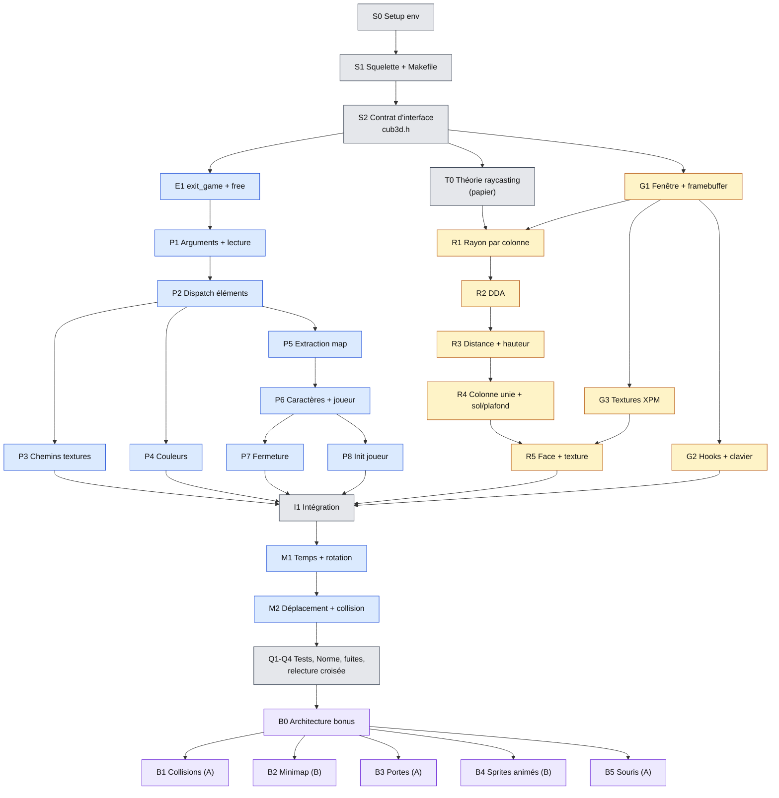

# cub3D — Feuille de route du binôme (sujet v12.0)

> minilibx-linux · Fedora (école) / Nobara (maison) · Norme 42 · du premier `make` à la soutenance.
> Les cases `- [ ]` se cochent directement dans Obsidian, VS Code ou GitHub.

## Sommaire

0. [Mode d'emploi et points d'attention](#0-mode-demploi-et-points-dattention)
1. [Vue d'ensemble, diagramme, contrat d'interface](#1-vue-densemble-diagramme-contrat-dinterface)
2. [Arborescence et Makefile](#2-arborescence-et-makefile)
3. [Setup Fedora / Nobara](#3-setup-fedora--nobara)
4. [Remise à niveau debug](#4-remise-à-niveau-debug)
5. [Sortie propre et mémoire (module E)](#5-sortie-propre-et-mémoire-module-e)
6. [Guide de survie MiniLibX (module G)](#6-guide-de-survie-minilibx-module-g)
7. [Théorie du raycasting pas à pas (T0)](#7-théorie-du-raycasting-pas-à-pas-t0)
8. [Parsing du .cub (module P)](#8-parsing-du-cub-module-p)
9. [Rendu (module R)](#9-rendu-module-r)
10. [Déplacements (module M)](#10-déplacements-module-m)
11. [Identité visuelle](#11-identité-visuelle)
12. [Tests : maps prêtes à l'emploi + scripts](#12-tests--maps-prêtes-à-lemploi--scripts)
13. [Bonus (module B)](#13-bonus-module-b)
14. [Préparation soutenance](#14-préparation-soutenance)
15. [Template README.md](#15-template-readmemd)

---

## 0. Mode d'emploi et points d'attention

**Lecture** : §0 à §5 ensemble avant d'écrire une ligne de code du projet, §7 ensemble sur papier, puis chacun son module.

**Légende des unités**

| Champ | Sens |
|---|---|
| Qui | **A**, **B** ou **A+B** (répartition proposée au §1.3) |
| Charge | 🟢 léger · 🟡 moyen · 🔴 lourd |
| ⚠️ | ressource ou info dont je ne suis pas certain : à vérifier |

**Ce qui a été vérifié en vrai pour ce document** (minilibx-linux du dépôt 42Paris, dernier commit de juin 2026, compilée et lancée sous Xvfb) : le Makefile du §2 (pas de relink, `bonus`, recompilation de la libft), le header du §1.4 (`norminette` : OK), le chargement XPM et les cas d'échec, un arrêt MLX propre sous valgrind (« All heap blocks were freed »), le fichier de suppression, les deux scripts de tests du §12 (83 fichiers générés, tous conformes aux règles décrites ici, et l'attribution fichier → message d'erreur du §8.2), la conversion d'images en XPM (§11, dont un piège de couleurs), le header bonus du §13 (`norminette` : OK).

### 0.1 Les trois `mlx.h` joints

Seul le premier (celui qui déclare `mlx_destroy_display`, `mlx_loop_end`, `mlx_get_screen_size`) est la version Linux. Les deux autres sont des versions macOS (OpenGL 2014 et Metal 2019) : `mlx_mouse_move(win, x, y)` n'y a pas la même signature, `mlx_destroy_display` n'existe pas. **Ignorez-les.**

Et même la version Linux jointe est un peu ancienne : dans le dépôt actuel, `mlx_key_hook`, `mlx_mouse_hook` et `mlx_expose_hook` ont des prototypes typés, alors que `mlx_hook` et `mlx_loop_hook` gardent `int (*funct)()`. Règle : **le seul `mlx.h` qui fait foi est celui du dossier `mlx/` de votre repo.**

### 0.2 Piège GCC ≥ 15 (Fedora 42+, Nobara 44) — vérifié

Depuis GCC 15, le standard par défaut est C23, où `int (*f)()` signifie « fonction **sans** paramètre ». Résultat testé :

```
error: passing argument 4 of 'mlx_hook' from incompatible pointer type
```

dès qu'on passe un handler `int on_key(int keysym, t_game *g)` à `mlx_hook`. La MLX elle-même compile en C23 (le dépôt a été corrigé), c'est **votre** code qui casse.

**Choix** : ajouter `-std=gnu17` aux `CFLAGS` (le standard par défaut de GCC 8 à 14). Testé : plus aucune erreur, même code sur toutes les machines. Soyez prêts à le justifier en soutenance (c'est une très bonne question à se faire poser).

### 0.3 Autres faits utiles, vérifiés dans les sources

- `mlx_key_hook` écoute **KeyRelease** sous Linux (`mlx_key_hook.c`) : inutilisable pour des touches maintenues.
- La croix rouge déclenche le hook enregistré sur `DestroyNotify` (17) via le message `WM_DELETE_WINDOW` (`mlx_loop.c`).
- `mlx_xpm_file_to_image` ne vérifie **pas** l'extension (un XPM renommé en `.png` se charge) et renvoie `NULL` sur fichier vide, corrompu ou dossier.
- Les pixels `None` d'un XPM valent `0xFF000000` (`mlx_xpm.c`) : utile pour la transparence des sprites en bonus.
- `libmlx.a` n'a plus besoin de `libbsd` : `-lmlx -lXext -lX11 -lm` suffit.

---

## 1. Vue d'ensemble, diagramme, contrat d'interface

### 1.1 Le programme en une image

```text
./cub3D scene.cub
   │
   ├─ parse_scene()  ── P1 lecture → P2..P4 éléments → P5 map → P6..P7 validation → P8 joueur
   │                     (toute erreur → exit_game(g, 1, msg) → "Error\n<msg>" sur stderr)
   ├─ gfx_init()     ── mlx_init → textures XPM → fenêtre → image « frame »
   ├─ setup_hooks()  ── KeyPress / KeyRelease / FocusOut / croix / loop_hook
   └─ mlx_loop()
         └─ game_loop() à chaque tour :
               dt = now - last (plafonné)  →  update_player(dt)  →  render_frame()
                                                   │                    └─ pour chaque colonne x :
                                            touches tenues                cast_ray → run_dda → draw_column
                                            + collisions               puis mlx_put_image_to_window
```

### 1.2 Découpage : Phase › Module › Unité

| Phase | Module | Unités |
|---|---|---|
| 0 Fondations | S Setup | S0 environnement · S1 squelette + Makefile · S2 contrat d'interface |
| | E Erreurs/mémoire | E1 `exit_game` + libérations |
| 1 Théorie | T | T0 raycasting sur papier |
| 2 Briques | P Parsing | P1 arguments + lecture · P2 dispatch des éléments · P3 chemins de textures · P4 couleurs · P5 extraction de la map · P6 caractères + joueur · P7 fermeture · P8 init joueur |
| | G MiniLibX | G1 fenêtre + framebuffer · G2 hooks + clavier · G3 textures |
| | R Rendu | R1 rayon par colonne · R2 DDA · R3 distance + hauteur · R4 colonne unie + sol/plafond · R5 face + texture |
| 3 Assemblage | I | I1 intégration parsing → rendu |
| | M Mouvement | M1 temps + rotation · M2 déplacement + collision |
| 4 Qualité | Q | Q1 tests · Q2 Norme · Q3 fuites · Q4 relecture croisée |
| 5 Bonus | B | B0 architecture · B1 collisions · B2 minimap · B3 portes · B4 sprites animés · B5 souris |

### 1.3 Diagramme des dépendances, ordre et répartition



Légende : gris = ensemble, bleu = **A** (parsing, erreurs, mouvement, tests), jaune = **B** (MiniLibX, rendu), violet = bonus.

**Pourquoi ce partage** : A et B démarrent en parallèle dès que le contrat existe, sans jamais s'attendre (B rend une map en dur, A valide des fichiers sans fenêtre). Les deux portent de la théorie : T0 se fait **ensemble**, et chacun doit pouvoir expliquer le module de l'autre (Q4 : relecture croisée obligatoire, c'est ce qui sauve une soutenance).

**Ordre conseillé et jalons**

| # | Jalon (vérifiable) | Unités |
|---|---|---|
| J1 | `make` sans relink, fenêtre noire qui se ferme par ESC et croix, 0 fuite | S0–S2, E1, G1, G2 |
| J2 | Tous les `.cub` invalides du §12 affichent `Error`, 0 fuite | P1–P8 |
| J3 | Murs de couleur unie sur une map en dur, rotation au clavier | T0, R1–R4 |
| J4 | Murs texturés, N/S/E/W distincts et non inversés | G3, R5 |
| J5 | La map parsée s'affiche, le joueur spawn au bon endroit dans la bonne direction | I1 |
| J6 | Déplacements fluides, aucune sortie de map possible | M1, M2 |
| J7 | Mandatory parfait : tests, Norme, valgrind, relink, relecture croisée | Q1–Q4 |
| J8 | Bonus un par un, chacun activable seul | B0–B5 |

### 1.4 Contrat d'interface (S2)

À écrire **ensemble, avant tout code**, puis à ne modifier qu'à deux. Le header ci-dessous passe `norminette` tel quel (vérifié). Les prototypes sont les **points de jonction** : tant qu'ils ne changent pas, chacun code son module sans bloquer l'autre.

```c
/* ************************************************************************** */
/*                                                                            */
/*                                                        :::      ::::::::   */
/*   cub3d.h                                            :+:      :+:    :+:   */
/*                                                    +:+ +:+         +:+     */
/*   By: login1 <login1@student.42.fr>              +#+  +:+       +#+        */
/*                                                +#+#+#+#+#+   +#+           */
/*   Created: 2026/09/28 12:00:00 by login1            #+#    #+#             */
/*   Updated: 2026/09/28 12:00:00 by login1           ###   ########.fr       */
/*                                                                            */
/* ************************************************************************** */

#ifndef CUB3D_H
# define CUB3D_H

# include <fcntl.h>
# include <math.h>
# include <stdlib.h>
# include <sys/time.h>
# include <unistd.h>
# include <X11/X.h>
# include <X11/keysym.h>
# include "libft.h"
# include "mlx.h"

/* Choix techniques : tout ce qu'on peut vous demander de changer en live */
# define WIN_W 960
# define WIN_H 720
# define WIN_TITLE "cub3D"
# define FOV_PLANE 0.66
# define MOVE_SPEED 3.0
# define ROT_SPEED 2.5
# define MAX_DT 0.05
# define MIN_PERP 0.0001

/* Bitmask des 6 elements du .cub (bit n = element n de t_elem) */
# define ALL_ELEMS 63

/* Messages d'erreur : exit_game() ecrit "Error\n" puis le message */
# define E_USAGE "usage: ./cub3D <scene.cub>"
# define E_EXT "scene file must end with .cub"
# define E_OPEN "cannot open scene file"
# define E_ISDIR "path is a directory"
# define E_MALLOC "memory allocation failed"
# define E_EMPTY "scene file is empty"
# define E_IDENT "unknown or misplaced identifier"
# define E_DUP "element defined twice"
# define E_MISSING "missing element before map"
# define E_TEXPATH "invalid texture path"
# define E_TEXLOAD "texture could not be loaded"
# define E_COLOR "invalid color (expected R,G,B in [0,255])"
# define E_NOMAP "no map in scene file"
# define E_MAPCHAR "invalid character in map"
# define E_MAPGAP "empty line inside map or content after map"
# define E_PLAYER "map must contain exactly one player"
# define E_OPENMAP "map is not closed by walls"
# define E_BADSPACE "tab or carriage return in scene file (CRLF?)"
# define E_MLX "minilibx initialisation failed"

typedef enum e_elem
{
	EL_NO,
	EL_SO,
	EL_WE,
	EL_EA,
	EL_F,
	EL_C
}	t_elem;

typedef enum e_key
{
	K_W,
	K_A,
	K_S,
	K_D,
	K_LEFT,
	K_RIGHT,
	K_COUNT
}	t_key;

typedef struct s_vec
{
	double	x;
	double	y;
}	t_vec;

typedef struct s_img
{
	void	*ptr;
	char	*addr;
	int		bpp;
	int		line_len;
	int		endian;
	int		w;
	int		h;
}	t_img;

/* Resultat du parsing (lines = fichier brut, libere apres parsing) */
typedef struct s_scene
{
	char	*tex_path[4];
	int		floor;
	int		ceil;
	int		found;
	char	**lines;
}	t_scene;

/* grid rectangulaire h x w, completee par des espaces */
typedef struct s_map
{
	char	**grid;
	int		w;
	int		h;
}	t_map;

/* Repere : x = colonne (vers l'Est), y = ligne (vers le Sud) */
typedef struct s_player
{
	t_vec	pos;
	t_vec	dir;
	t_vec	plane;
}	t_player;

typedef struct s_ray
{
	t_vec	dir;
	t_vec	side;
	t_vec	delta;
	int		map_x;
	int		map_y;
	int		step_x;
	int		step_y;
	int		hit_side;
	double	perp;
}	t_ray;

typedef struct s_col
{
	int		x;
	int		line_h;
	int		start;
	int		end;
	int		tex_x;
	double	step;
	double	tex_pos;
	t_img	*tex;
}	t_col;

/* zbuf, ext et ext_free restent NULL en mandatory (crochets bonus) */
typedef struct s_game
{
	void		*mlx;
	void		*win;
	t_img		frame;
	t_img		tex[4];
	t_scene		sc;
	t_map		map;
	t_player	pl;
	int			keys[K_COUNT];
	double		last_time;
	double		*zbuf;
	void		*ext;
	void		(*ext_free)(struct s_game *g);
}	t_game;

/* E - sortie et memoire */
void	exit_game(t_game *g, int status, char *msg);
void	free_tab(char **tab);
void	destroy_gfx(t_game *g);

/* P - parsing : un char * renvoye = message E_* (NULL = OK), jamais alloue */
void	parse_scene(t_game *g, char *path);
int		check_extension(char *path, char *ext);
int		check_readable_file(char *path);
char	**read_lines(char *path, int *err);
int		is_blank(char *line);
char	*parse_element(t_game *g, char *line);
char	*parse_texture(t_game *g, int el, char *rest);
int		parse_rgb(char *str, int *out);
char	*build_map(t_game *g, char **lines);
char	*check_chars(t_map *map);
int		check_map(t_map *map, int *err_row, int *err_col);
void	init_player(t_game *g);

/* Points de variation (fichier mandatory OU _bonus, meme prototype) */
int		is_map_char(char c);
int		is_walkable(char c);
int		is_solid(t_game *g, int x, int y);
t_img	*select_texture(t_game *g, t_ray *r);

/* G - MiniLibX */
void	gfx_init(t_game *g);
void	put_pixel(t_img *img, int x, int y, int color);
int		get_texel(t_img *tex, int x, int y);
void	setup_hooks(t_game *g);
int		on_key_press(int keysym, t_game *g);
int		on_key_release(int keysym, t_game *g);
int		on_close(t_game *g);
int		on_focus_out(t_game *g);
int		game_loop(t_game *g);

/* R - raycasting et rendu */
void	render_frame(t_game *g);
void	cast_ray(t_game *g, int x, t_ray *r);
void	run_dda(t_game *g, t_ray *r);
void	draw_column(t_game *g, t_ray *r, int x);

/* M - deplacements */
double	now_seconds(void);
void	update_player(t_game *g, double dt);
void	rotate_player(t_player *p, double angle);
void	try_move(t_game *g, double dx, double dy);

#endif
```

**Règles du contrat** (à recopier en commentaire en tête de `exit.c`)

- [ ] `t_game g` est mis à zéro (`ft_bzero(&g, sizeof(g))`) au début de `main` : tous les pointeurs valent `NULL`, donc `exit_game` est appelable **depuis n'importe où**, même avant `mlx_init`.
- [ ] Tout ce qui est alloué et survit à une fonction est **rattaché à `g`** (propriétaire unique). Après chaque `free`, le pointeur repasse à `NULL`.
- [ ] Les fonctions « feuilles » (`parse_rgb`, `check_map`, `read_lines`…) **ne quittent jamais** : elles renvoient un code (un `int`, ou pour le parsing un message `E_*` / `NULL`, §8.1). Seules les fonctions « chef d'orchestre » (`parse_scene`, `gfx_init`, `main`, hooks) appellent `exit_game`, après avoir libéré leurs temporaires.
- [ ] Carte : `grid[y][x]`, `x` = colonne vers l'Est, `y` = ligne vers le Sud (même sens que l'écran).
- [ ] Couleur : `int` au format `0x00RRGGBB`.
- [ ] `zbuf`, `ext`, `ext_free` restent `NULL` en mandatory : ce sont les seuls crochets pour les bonus.

**Travailler en isolation** (pour chaque unité, un petit `main` de test dans `tests/unit/`, compilé à la main) :

```bash
cc -Wall -Wextra -Werror -std=gnu17 -g3 -Iincludes -Ilibft -Imlx \
   src/core/parsing/color.c tests/unit/t_color.c libft/libft.a -o /tmp/t_color
```

- B développe le rendu avec un `tests/unit/stub_scene.c` qui remplit `g->map` via `ft_split("111111\n1N0001\n111111", '\n')`, les couleurs et le joueur en dur.
- A développe le parsing avec une fonction `debug_dump(t_game *g)` (dans `tests/unit/`) qui affiche éléments, map paddée et joueur.
- ⚠️ `norminette` à la racine vérifie **tous** les `.c`/`.h` du repo, `tests/` compris : soit vos tests unitaires sont à la Norme, soit ils ne sont pas poussés (`.gitignore`). Les scripts `.sh` ne posent pas de problème.

**Terminé quand**
- [ ] Le header compile (fichier `.c` vide qui l'inclut) et passe `norminette`.
- [ ] Chacun sait quelles fonctions il implémente et lesquelles il consomme.
- [ ] Les stubs de test existent pour que A et B démarrent le même jour.

**Pièges** : modifier une struct seul dans son coin (l'autre ne compile plus) ; oublier que la Norme limite à 4 paramètres et 5 variables (d'où `t_ray` et `t_col` qui transportent l'état) ; mettre du code dans un `.h`.

---

## 2. Arborescence et Makefile

### 2.1 Arborescence (S1)

```text
cub3D/
├── Makefile
├── README.md
├── .gitignore
├── includes/
│   ├── cub3d.h                 # contrat (§1.4)
│   └── cub3d_bonus.h           # inclut cub3d.h + t_bonus (§13)
├── libft/                      # vos sources + leur Makefile
├── mlx/                        # minilibx-linux, SANS son .git
├── src/
│   ├── core/                   # compilé dans cub3D ET cub3D_bonus
│   │   ├── exit/     exit.c free.c
│   │   ├── parsing/  parse_scene.c file.c elements.c texture_path.c color.c
│   │   │             map_build.c map_check.c player.c
│   │   ├── gfx/      gfx_init.c pixel.c keys.c
│   │   ├── render/   frame.c raycast.c column.c
│   │   └── move/     move.c time.c
│   ├── mandatory/              # points de variation, version obligatoire
│   │   └── main.c rules.c hooks.c loop.c collide.c
│   └── bonus/                  # mêmes points de variation + modules bonus
│       └── main_bonus.c rules_bonus.c hooks_bonus.c loop_bonus.c
│           collide_bonus.c ext_bonus.c minimap_bonus.c doors_bonus.c
│           sprites_bonus.c sprites_draw_bonus.c mouse_bonus.c
├── textures/                   # vos XPM (§11) + textures/test générées (§12)
├── maps/                       # valid/ invalid/ générées (§12), demo/ bonus/ à vous
└── tests/                      # gen_maps.sh run_tests.sh x11.supp (unit/ : voir §1.4)
```

**Pourquoi `core/` + points de variation** : un fichier comme `rules.c` existe en deux versions de même prototype (`rules.c` et `rules_bonus.c`) ; le Makefile choisit laquelle compiler. Le mandatory ne contient **aucune** ligne de bonus, et le cœur (parsing, DDA, textures, sortie) n'est écrit qu'une fois.

**`.gitignore`**

```text
obj/
cub3D
cub3D_bonus
mlx/obj/
mlx/libmlx*.a
mlx/Makefile.gen
mlx/test/Makefile.gen
mlx/test/mlx-test
mlx/test/*.o
tests/unit/
```

### 2.2 Makefile (vérifié : pas de relink, `bonus`, recompilation libft)

```makefile
NAME		:= cub3D
NAME_BONUS	:= cub3D_bonus

CC			:= cc
CFLAGS		:= -Wall -Wextra -Werror -std=gnu17
DEPFLAGS	:= -MMD -MP
INC			:= -Iincludes -Ilibft -Imlx

LIBFT_DIR	:= libft
LIBFT		:= $(LIBFT_DIR)/libft.a
MLX_DIR		:= mlx
MLX			:= $(MLX_DIR)/libmlx.a
LDLIBS		:= -L$(LIBFT_DIR) -lft -L$(MLX_DIR) -lmlx -lXext -lX11 -lm

SRC_DIR		:= src
OBJ_DIR		:= obj

CORE		:= core/exit/exit.c core/exit/free.c \
			   core/parsing/parse_scene.c core/parsing/file.c \
			   core/parsing/elements.c core/parsing/texture_path.c \
			   core/parsing/color.c core/parsing/map_build.c \
			   core/parsing/map_check.c core/parsing/player.c \
			   core/gfx/gfx_init.c core/gfx/pixel.c core/gfx/keys.c \
			   core/render/frame.c core/render/raycast.c core/render/column.c \
			   core/move/move.c core/move/time.c
MAND		:= mandatory/main.c mandatory/rules.c mandatory/hooks.c \
			   mandatory/loop.c mandatory/collide.c
BONUS		:= bonus/main_bonus.c bonus/rules_bonus.c bonus/hooks_bonus.c \
			   bonus/loop_bonus.c bonus/collide_bonus.c bonus/ext_bonus.c \
			   bonus/minimap_bonus.c bonus/doors_bonus.c bonus/sprites_bonus.c \
			   bonus/sprites_draw_bonus.c bonus/mouse_bonus.c

OBJ_CORE	:= $(CORE:%.c=$(OBJ_DIR)/%.o)
OBJ_MAND	:= $(MAND:%.c=$(OBJ_DIR)/%.o)
OBJ_BONUS	:= $(BONUS:%.c=$(OBJ_DIR)/%.o)
DEPS		:= $(OBJ_CORE:.o=.d) $(OBJ_MAND:.o=.d) $(OBJ_BONUS:.o=.d)

all: $(NAME)

bonus: $(NAME_BONUS)

$(NAME): $(OBJ_CORE) $(OBJ_MAND) $(LIBFT) $(MLX)
	$(CC) $(CFLAGS) $(OBJ_CORE) $(OBJ_MAND) $(LDLIBS) -o $@

$(NAME_BONUS): $(OBJ_CORE) $(OBJ_BONUS) $(LIBFT) $(MLX)
	$(CC) $(CFLAGS) $(OBJ_CORE) $(OBJ_BONUS) $(LDLIBS) -o $@

$(OBJ_DIR)/%.o: $(SRC_DIR)/%.c
	@mkdir -p $(dir $@)
	$(CC) $(CFLAGS) $(DEPFLAGS) $(INC) -c $< -o $@

$(LIBFT): FORCE
	@$(MAKE) --no-print-directory -C $(LIBFT_DIR)

$(MLX):
	@$(MAKE) --no-print-directory -C $(MLX_DIR)

FORCE:

clean:
	@$(MAKE) --no-print-directory -C $(LIBFT_DIR) clean
	@if [ -f $(MLX_DIR)/Makefile.gen ]; then \
		$(MAKE) --no-print-directory -C $(MLX_DIR) clean; fi
	rm -rf $(OBJ_DIR)

fclean: clean
	@$(MAKE) --no-print-directory -C $(LIBFT_DIR) fclean
	rm -f $(NAME) $(NAME_BONUS)

re: fclean all

-include $(DEPS)

.PHONY: all bonus clean fclean re FORCE
```

**Ce qu'il faut savoir expliquer**

| Ligne | Pourquoi |
|---|---|
| `$(LIBFT): FORCE` | le sous-make de la libft est **toujours** lancé (il détecte seul si une source a changé) ; si `libft.a` n'a pas bougé, sa date non plus, donc pas de relink. Testé : `make` deux fois → rien ; `touch libft/ft_strlen.c` → recompile + relink (légitime). |
| `$(MLX):` sans prérequis | la MLX n'est construite que si `libmlx.a` n'existe pas (ses sources ne changent jamais). |
| `if [ -f ... Makefile.gen ]` | `make -C mlx clean` échoue sur une MLX jamais compilée (le `clean` de la MLX a besoin du `Makefile.gen` créé par `configure`). |
| `-MMD -MP` + `-include $(DEPS)` | modifier `cub3d.h` recompile tous les `.c` qui l'incluent. Sans ça : binaire incohérent après changement de struct. |
| `-std=gnu17` | voir §0.2. |
| `cub3D_bonus` séparé | `make` puis `make bonus` puis `make` ne relinkent jamais (un seul nom de binaire ferait du ping-pong). |
| `$(CFLAGS)` à l'édition de liens | permet `make re CFLAGS="... -fsanitize=address"` (§4). |

**Ressources** : manuel GNU make, §4.3 *Types of Prerequisites*, §4.6 *Phony Targets*, §5.7 *Recursive Use of make*, §10.5.3 *Automatic Variables* (<https://www.gnu.org/software/make/manual/make.html>) ; option `-MMD` : manuel GCC, *Preprocessor Options*.

**Terminé quand**
- [ ] `make` ×2 : la deuxième fois, aucune commande `cc`.
- [ ] `make bonus` ×2 puis `make` : aucune commande `cc`.
- [ ] `make fclean` fonctionne sur un clone neuf (MLX jamais compilée).
- [ ] `make re` reconstruit tout.
- [ ] `git clone` du repo dans `/tmp` + `make` : compile (preuve qu'il ne manque rien, notamment `mlx/`).

**Pièges** : cloner la MLX et la pousser **avec son `.git`** → le correcteur récupère un dossier `mlx/` vide (sous-module fantôme). Faites `rm -rf mlx/.git` avant le premier commit. Oublier un fichier dans `CORE`/`MAND` → « undefined reference ». Wildcards (`$(wildcard ...)`) : interdites dans la plupart des corrections 42, listez les fichiers.

---

## 3. Setup Fedora / Nobara

### 3.1 Paquets

```bash
sudo dnf install gcc make git libX11-devel libXext-devel valgrind gdb libasan ImageMagick
# optionnel : xorg-x11-server-Xvfb (fenêtre virtuelle pour tester sans écran)
```

`libasan` est un paquet séparé sur Fedora : sans lui, `-fsanitize=address` échoue à l'édition de liens. `libbsd-devel` est cité dans le README de la MLX mais n'est plus nécessaire à `libmlx.a` (vérifié).

À l'école vous n'aurez probablement pas `sudo` : vérifiez dès la première séance que `libX11-devel`, `libXext-devel`, `valgrind` sont présents (`rpm -q libX11-devel libXext-devel valgrind`).

### 3.2 MiniLibX

```bash
git clone https://github.com/42Paris/minilibx-linux.git mlx
rm -rf mlx/.git
make -C mlx                 # lance ./configure, crée libmlx.a et test/mlx-test
./mlx/test/mlx-test         # smoke test : des fenêtres doivent s'ouvrir
```

Si `configure` dit *Can't find a suitable X11 include directory* : il manque `libX11-devel` ou `libXext-devel` (il cherche `X11/Xlib.h` **et** `X11/extensions/XShm.h`).

### 3.3 X11 ou Wayland ?

```bash
echo $XDG_SESSION_TYPE      # wayland (défaut KDE Plasma 6 / GNOME) ou x11
echo $DISPLAY               # doit être non vide, ex. :0 ou :1
```

La MLX parle X11. Sous Wayland, elle passe par **XWayland** (installé par défaut avec Plasma) : le mandatory fonctionne normalement. Différences à connaître :
- le déplacement forcé du curseur (`mlx_mouse_move`, bonus souris) peut être ignoré sous XWayland → prévoir une rotation par *delta* de position (§13, B5) ;
- les raccourcis clavier globaux du bureau peuvent intercepter certaines touches.

Testez aussi sur la session de l'école (même commandes) : c'est là que se passe la correction.

### 3.4 Clavier

La MLX transmet des *keysyms* (le caractère imprimé sur la touche, en minuscule, indépendamment de Maj/Verr. Maj). En AZERTY, W/A/S/D ne sont donc pas groupées. Pour jouer confortablement chez vous : ajoutez la disposition « English (US) » dans les paramètres clavier de KDE et basculez pendant les tests. Vérifiez la disposition des claviers de l'école.

**Terminé quand**
- [ ] `./mlx/test/mlx-test` ouvre des fenêtres chez vous **et** à l'école.
- [ ] `valgrind --version`, `gdb --version` répondent.
- [ ] Un `hello.c` compilé avec `-fsanitize=address` se lie et s'exécute.

---

## 4. Remise à niveau debug

### 4.1 Compiler pour déboguer

```bash
make re CFLAGS="-Wall -Wextra -Werror -std=gnu17 -g3 -O0"
```

`-g3` : symboles + macros ; `-O0` : les variables ne sont pas « optimisées » (sinon gdb affiche `<optimized out>`). Pensez à `make re` sans ces flags avant de pousser.

### 4.2 Valgrind

```bash
valgrind --leak-check=full --show-leak-kinds=all --track-origins=yes \
         --track-fds=yes ./cub3D maps/valid/v_subject_small.cub
```

| Catégorie | Sens | À 42 |
|---|---|---|
| definitely lost | plus aucun pointeur vers le bloc | fuite, 0 obligatoire |
| indirectly lost | perdu parce que son « parent » est perdu (ex. lignes d'un `char **`) | se corrige en corrigeant le parent |
| possibly lost | pointeur vers l'intérieur du bloc | à investiguer |
| still reachable | encore pointé à la sortie (ex. stash statique de `get_next_line`) | beaucoup de correcteurs le comptent : visez 0 |

**Lire un rapport** : descendez la pile jusqu'à la première ligne **de vos fichiers** (`by 0x...: read_lines (file.c:42)`) : c'est le `malloc` dont personne n'a fait le `free`.

**Vos fuites ou celles de la lib ?** Fait vérifié : avec l'ordre de destruction du §5 (`mlx_destroy_image` → `mlx_destroy_window` → `mlx_destroy_display` → `free(mlx)`), la MLX actuelle termine avec **« All heap blocks were freed — no leaks are possible »**. Donc, par défaut, **toute fuite est la vôtre**. Exemple mesuré en oubliant `mlx_destroy_display` et `free(mlx)` :

```text
definitely lost: 136 bytes in 1 blocks      <- by mlx_init / by main : free(mlx) oublié
still reachable: 55,541 bytes in 52 blocks  <- tout libX11 : mlx_destroy_display oublié
```

**Fichier de suppression `tests/x11.supp`** (filet de sécurité) : il ne masque que les blocs *still reachable* alloués dans libX11/libxcb, jamais un *definitely lost*. Testé sur l'exemple ci-dessus : les 55 Ko X11 passent en `suppressed`, les 136 octets de `free(mlx)` oublié restent signalés.

```text
{
   x11_still_reachable
   Memcheck:Leak
   match-leak-kinds: reachable
   ...
   obj:*/libX11.so*
}
{
   xcb_still_reachable
   Memcheck:Leak
   match-leak-kinds: reachable
   ...
   obj:*/libxcb.so*
}
```

Usage : `valgrind --suppressions=tests/x11.supp ...`. Règle : lancez **d'abord sans** ; n'ajoutez la suppression que pour un bloc que vous avez identifié comme venant de la lib. Pour générer vos propres règles : `--gen-suppressions=all` puis copiez le bloc `{ ... }` affiché.

`--track-fds=yes` : liste les descripteurs encore ouverts à la sortie (un `.cub` ou une texture pas fermé). Les fd 0, 1, 2 hérités du terminal sont normaux.

### 4.3 gdb

```bash
gdb --args ./cub3D maps/valid/v_subject_small.cub
```

| Commande | Usage |
|---|---|
| `run` / `r` | lancer |
| `bt` | pile d'appels au moment du crash (**la** commande pour un segfault) |
| `frame 2` / `up` / `down` | se placer dans un appel de la pile |
| `print r->map_x`, `p g->map.grid[3]`, `p *r` | lire une variable, une struct entière |
| `break raycast.c:30`, `break draw_column if x == 480` | point d'arrêt, conditionnel |
| `next` / `step` / `finish` / `continue` | avancer ligne, entrer, sortir, reprendre |
| `watch g->pl.pos.x` | s'arrêter quand la valeur change |
| `info locals` | toutes les variables locales |
| `layout src` | affichage du source (mode TUI, `Ctrl+X A` pour quitter) |

Scénario type « segfault » : `run` → `bt` → `frame N` sur votre fonction → `p` des indices (`map_x`, `map_y`, `map.w`) → vous voyez l'accès hors grille. La fenêtre MLX se fige pendant une pause gdb : normal.

### 4.4 AddressSanitizer

```bash
make re CFLAGS="-Wall -Wextra -Werror -std=gnu17 -g3 -fsanitize=address,undefined"
./cub3D maps/invalid/i_hole_inside.cub
```

- Détecte immédiatement : lecture/écriture hors tableau (`grid[y][x]` hors bornes), use-after-free, double free ; `undefined` ajoute les débordements d'entiers (ex. `line_h` quand la distance tend vers 0).
- **Ne jamais combiner avec valgrind** (binaire ASan sous valgrind = résultats faux). Deux builds, deux outils.
- LeakSanitizer est actif par défaut : sur X11, si une fuite de lib apparaît, `LSAN_OPTIONS=suppressions=lsan.supp` avec une ligne `leak:libX11.so`.

### 4.5 Ressources précises

- Valgrind User Manual, §2.5 *Suppressing errors* : <https://valgrind.org/docs/manual/manual-core.html#manual-core.suppress> ; Memcheck, section *Memory leak detection* : <https://valgrind.org/docs/manual/mc-manual.html#mc-manual.leaks> ⚠️ (numéros de section qui bougent selon la version, fiez-vous aux titres).
- GDB manual : chapitre 1 *A Sample GDB Session* (20 min, à faire en entier), §5.1 *Breakpoints, Watchpoints, and Catchpoints*, §8.2 *Backtraces* : <https://sourceware.org/gdb/current/onlinedocs/gdb/>.
- *Beej's Quick Guide to GDB* (une page, parfait pour démarrer) : <https://beej.us/guide/bggdb/>.
- Manuel GCC, *Instrumentation Options* (`-fsanitize=address`) : <https://gcc.gnu.org/onlinedocs/gcc/Instrumentation-Options.html>.
- Suppressions LeakSanitizer : wiki google/sanitizers, page *AddressSanitizerLeakSanitizer*, section *Suppressions* ⚠️.

**Terminé quand** (compétences, pas code)
- [ ] Vous localisez la ligne d'un segfault volontaire (`grid[-1][0]`) en moins de 2 minutes avec `bt`.
- [ ] Vous savez montrer du doigt le `malloc` responsable d'une fuite dans un rapport valgrind.
- [ ] Vous savez expliquer *definitely lost* vs *still reachable* et pourquoi vous n'avez pas besoin de la suppression X11.

---

## 5. Sortie propre et mémoire (module E)

### E1 · `exit_game` et libérations

> **Qui** A · **Charge** 🟢 · **Dépend de** S2 · **Fichiers** `core/exit/exit.c`, `core/exit/free.c`

**Objectif** — Une seule porte de sortie, appelable depuis le parsing comme depuis un hook, qui affiche l'erreur éventuelle, libère tout ce qui existe et quitte.

**E/S** — `void exit_game(t_game *g, int status, char *msg)` : `msg == NULL` → sortie normale (ESC, croix, `status` 0) ; sinon `"Error\n"` + `msg` + `"\n"` sur **stderr** et `status` 1.

**Notions → ressources**
- Propriété de la mémoire et invariant « pointeur libéré = `NULL` » : pas de chapitre unique ; relisez votre `ft_split` (libération partielle en cas d'échec), c'est le même raisonnement.
- `exit(3)` : `man 3 exit` (les handlers `atexit` ne sont pas utilisés ici ; la mémoire du processus est rendue à l'OS mais valgrind, lui, la compte comme fuite si elle est encore allouée).

**Pseudo-code**

```text
exit_game(g, status, msg):
    si msg : écrire "Error\n", msg, "\n" sur le fd 2
    si g->ext_free : g->ext_free(g)          # bonus uniquement
    free_scene(&g->sc)                       # 4 chemins + lignes brutes du fichier
    free_tab(g->map.grid) ; g->map.grid = NULL
    destroy_gfx(g)
    exit(status)

destroy_gfx(g):
    pour i de 0 à 3 : si g->tex[i].ptr : mlx_destroy_image(g->mlx, g->tex[i].ptr)
    si g->frame.ptr : mlx_destroy_image(g->mlx, g->frame.ptr)
    si g->win       : mlx_destroy_window(g->mlx, g->win)
    si g->mlx       : mlx_destroy_display(g->mlx) ; free(g->mlx)
```

**Code clé** — l'ordre de destruction (images et fenêtre **avant** l'écran, l'écran avant le `free`) :

```c
if (g->win)
	mlx_destroy_window(g->mlx, g->win);
if (g->mlx)
{
	mlx_destroy_display(g->mlx);
	free(g->mlx);
}
```

**Terminé quand**
- [ ] Appel direct `exit_game(&g, 1, E_USAGE)` sur un `g` tout neuf : message correct, pas de crash, 0 fuite.
- [ ] Appel après chargement de 2 textures sur 4 : 0 fuite (les 2 autres `ptr` sont `NULL`).
- [ ] ESC et croix passent par la même fonction.

**Tests** — petit `main` qui remplit progressivement `g` (1 chemin, puis une grid, puis `mlx_init`…) et appelle `exit_game` à chaque étape, sous valgrind.

**Pièges**
- `free(g)` alors que `g` est sur la pile de `main` → crash.
- Pointeur libéré mais pas remis à `NULL` → double free si `exit_game` repasse dessus.
- Temporaire local (tokens d'un `ft_split`) vivant au moment de l'appel → fuite : libérez-le **avant**, ou rattachez-le à `g`.
- `get_next_line` avec stash statique : s'arrêter avant EOF laisse le stash alloué (*still reachable*). Soit on lit **toujours** jusqu'à `NULL` (choix du §8), soit votre gnl a un mode de purge.
- Message sur stdout au lieu de stderr : la plupart des correcteurs ne le verront pas, mais les scripts (dont le vôtre, §12) si.

---

## 6. Guide de survie MiniLibX (module G)

### 6.1 Les fonctions réellement utiles

| Fonction (version Linux) | Rôle | À savoir |
|---|---|---|
| `mlx_init()` | connexion au serveur X | `NULL` si pas de `DISPLAY` |
| `mlx_new_window(mlx, w, h, titre)` | fenêtre | non redimensionnable (la MLX l'empêche) |
| `mlx_new_image(mlx, w, h)` | image hors écran | c'est votre framebuffer |
| `mlx_get_data_addr(img, &bpp, &line_len, &endian)` | adresse des pixels | `line_len` en **octets**, peut dépasser `w * 4` |
| `mlx_put_image_to_window(mlx, win, img, x, y)` | afficher | une fois par frame |
| `mlx_xpm_file_to_image(mlx, path, &w, &h)` | charger une texture | `NULL` si échec ; ne vérifie pas l'extension |
| `mlx_hook(win, event, mask, f, param)` | brancher un événement X11 | voir 6.3 |
| `mlx_loop_hook(mlx, f, param)` | fonction appelée à chaque tour de boucle | votre `game_loop` |
| `mlx_loop(mlx)` | boucle d'événements | ne rend la main qu'après `mlx_loop_end` |
| `mlx_destroy_image/window/display` | nettoyage | ordre du §5 |
| `mlx_mouse_move/hide/get_pos(mlx, win, ...)` | bonus souris | signatures Linux ≠ macOS |

**À éviter** : `mlx_pixel_put` (voir 6.2) ; `mlx_key_hook` (déclenché au **relâchement** sous Linux) ; `mlx_do_key_autorepeatoff` (modifie un réglage **global** du serveur X, qui reste désactivé pour tout le bureau si votre programme crashe).

### 6.2 Images vs `mlx_pixel_put`

- `mlx_pixel_put` = une requête X11 **par pixel** : 960 × 720 = 691 200 requêtes par frame, envoyées au serveur une par une, et affichées au fur et à mesure (on voit l'image se dessiner, ça scintille).
- Une image = un tableau en mémoire (partagé avec le serveur via l'extension MIT-SHM). On écrit tous les pixels « gratuitement », puis **un seul** `mlx_put_image_to_window` affiche la frame complète d'un coup : c'est un double buffering de fait.

**Écrire dans le buffer** (le cœur de `put_pixel` et `get_texel`) :

```c
dst = img->addr + (y * img->line_len + x * (img->bpp / 8));
*(unsigned int *)dst = color;
```

- `line_len` : octets par ligne, **à utiliser tel quel** (padding possible).
- `bpp` : 32 en pratique (4 octets par pixel, format `0x00RRGGBB` en little-endian).
- `endian` : ignorable en local (serveur et programme sur la même machine).
- Couleur depuis R, G, B : `(r << 16) | (g << 8) | b`.

### 6.3 Hooks : touches maintenues, croix, boucle

| Événement (`<X11/X.h>`) | Code | Masque | Signature du handler | Usage |
|---|---|---|---|---|
| `KeyPress` | 2 | `KeyPressMask` (1L<<0) | `int f(int keysym, t_game *g)` | touche enfoncée |
| `KeyRelease` | 3 | `KeyReleaseMask` (1L<<1) | `int f(int keysym, t_game *g)` | touche relâchée |
| `MotionNotify` | 6 | `PointerMotionMask` (1L<<6) | `int f(int x, int y, t_game *g)` | bonus souris |
| `FocusOut` | 10 | `FocusChangeMask` (1L<<21) | `int f(t_game *g)` | remise à zéro des touches |
| `DestroyNotify` | 17 | `0` ou `StructureNotifyMask` | `int f(t_game *g)` | croix rouge |

Les keysyms sont dans `<X11/keysym.h>` : `XK_Escape`, `XK_w`, `XK_a`, `XK_s`, `XK_d`, `XK_Left`, `XK_Right`. Ce sont des constantes d'en-tête, pas des fonctions : autorisées.

**Touches maintenues** — on ne bouge **pas** dans le handler clavier. Le handler ne fait qu'enregistrer l'état, le mouvement se fait dans `game_loop` :

```c
mlx_hook(g->win, KeyPress, KeyPressMask, on_key_press, g);
mlx_hook(g->win, KeyRelease, KeyReleaseMask, on_key_release, g);
mlx_hook(g->win, FocusOut, FocusChangeMask, on_focus_out, g);
mlx_hook(g->win, DestroyNotify, 0, on_close, g);
mlx_loop_hook(g->mlx, game_loop, g);
```

Pourquoi : un `KeyPress` n'arrive qu'une fois (puis des répétitions irrégulières dues à l'autorepeat). Avec un tableau `keys[K_COUNT]` mis à 1/0, plusieurs touches marchent en même temps (avancer + tourner) et le mouvement est régulier.

**Autorepeat** : maintenir une touche génère des paires *Release/Press* rapprochées. La MLX traite tous les événements en attente avant d'appeler le `loop_hook` (vu dans `mlx_loop.c`), donc l'état final reste « enfoncé » : rien à faire.

**Changement de fenêtre (exigence du sujet)** : si on fait Alt+Tab en tenant W, le *KeyRelease* part vers l'autre fenêtre et le joueur avance tout seul. `on_focus_out` remet tout `keys[]` à 0.

**Minimisation / fenêtre recouverte** : choix = on redessine **chaque tour de boucle**. L'image est donc toujours à jour au retour, sans gérer `Expose`. Coût : un cœur CPU occupé ; acceptable ici et beaucoup plus robuste qu'un rendu « seulement quand ça bouge ».

### 6.4 Distinguer vos fuites de celles de la lib

Voir §4.2 : avec la destruction complète, la MLX ne fuit pas. Si valgrind signale quelque chose, suivez la pile : première ligne dans **vos** fichiers = votre fuite.

### 6.5 Ressources précises (MLX)

- Les man pages livrées avec la lib : `man ./mlx/man/man3/mlx_new_image.3`, `mlx_loop.3`, `mlx_new_window.3`, `mlx_pixel_put.3`, `mlx.3`.
- Le code source, court et lisible : `mlx/mlx_loop.c` (boucle et croix), `mlx/mlx_int_param_event.c` (signatures des handlers), `mlx/mlx_key_hook.c`.
- `/usr/include/X11/X.h` : la liste officielle des codes d'événements et des masques.
- *42 Docs* (harm-smits), section MiniLibX : pages *Getting started*, *Images*, *Events*, *Hooks*, *Loops* : <https://harm-smits.github.io/42docs/libs/minilibx> ⚠️ en partie orientée macOS (keycodes et masques différents), utilisez-la pour les concepts seulement.
- Xlib — C Language X Interface, chapitre *Events* (masques d'événements) ⚠️ lecture optionnelle.

### G1 · Fenêtre + framebuffer + `put_pixel`

> **Qui** B · **Charge** 🟢 · **Dépend de** S2 · **Fichiers** `core/gfx/gfx_init.c`, `core/gfx/pixel.c`

**Objectif** — Ouvrir la fenêtre, créer l'image `frame`, savoir écrire un pixel dedans et l'afficher.

**E/S** — `gfx_init(g)` remplit `g->mlx`, `g->win`, `g->frame` (et les textures, G3) ; `put_pixel(&g->frame, x, y, color)`.

**Pseudo-code**

```text
gfx_init(g):
    g->mlx = mlx_init()                      ; si NULL → exit_game(E_MLX)
    charger les 4 textures (G3)              ; avant la fenêtre : pas de fenêtre
                                               qui clignote si une texture échoue
    g->win = mlx_new_window(...)             ; si NULL → exit_game(E_MLX)
    g->frame.ptr = mlx_new_image(WIN_W, WIN_H); si NULL → exit_game(E_MLX)
    g->frame.addr = mlx_get_data_addr(...)
```

**Terminé quand**
- [ ] Un main de test remplit l'image d'un dégradé (`color = x * 255 / WIN_W`) et l'affiche.
- [ ] `put_pixel` ignore silencieusement `x`/`y` hors écran (garde-fou contre un bug de rendu).
- [ ] valgrind : 0 fuite en quittant.

**Pièges** : oublier `mlx_get_data_addr` (adresse `NULL` → segfault au premier pixel) ; calculer l'adresse avec `WIN_W * 4` au lieu de `line_len` ; appeler `mlx_put_image_to_window` pour chaque colonne (inutilement lent).

### G2 · Hooks + état clavier + sortie

> **Qui** B · **Charge** 🟡 · **Dépend de** G1, E1 · **Fichiers** `core/gfx/keys.c`, `mandatory/hooks.c`, `mandatory/loop.c`

**Objectif** — ESC et croix quittent proprement ; W/A/S/D/←/→ tiennent un état fiable, même en changeant de fenêtre.

**E/S** — `setup_hooks(g)`, `on_key_press`, `on_key_release`, `on_focus_out`, `on_close`, `game_loop` (squelette : dessine la frame et l'affiche).

**Pseudo-code**

```text
key_index(keysym): XK_w→K_W, XK_a→K_A, XK_s→K_S, XK_d→K_D,
                   XK_Left→K_LEFT, XK_Right→K_RIGHT, sinon -1
on_key_press(k, g):   si k == XK_Escape → exit_game(g, 0, NULL)
                      i = key_index(k) ; si i >= 0 → g->keys[i] = 1
on_key_release(k, g): i = key_index(k) ; si i >= 0 → g->keys[i] = 0
on_focus_out(g):      tous les g->keys[i] = 0
on_close(g):          exit_game(g, 0, NULL)
```

**Terminé quand**
- [ ] Un `printf` de debug montre `W=1` tant que W est tenu, `W=0` au relâchement, même en tenant 5 secondes.
- [ ] Alt+Tab en tenant W puis retour : W vaut 0.
- [ ] ESC et croix : sortie, code 0, 0 fuite.
- [ ] Minimiser puis restaurer : l'image revient.

**Pièges** : `mlx_key_hook` (relâchement) ; déplacer le joueur directement dans `on_key_press` (saccadé, pas de touches simultanées) ; oublier le masque (`0` pour KeyPress → l'événement n'est jamais sélectionné) ; oublier `#include <X11/X.h>`.

### G3 · Textures XPM + `get_texel`

> **Qui** B · **Charge** 🟢 · **Dépend de** G1 · **Fichiers** `core/gfx/gfx_init.c`, `core/gfx/pixel.c`

**Objectif** — Charger les 4 textures dont les chemins viennent du parsing et lire un texel `(x, y)`.

**E/S** — entrée `g->sc.tex_path[i]` ; sortie `g->tex[i]` (`ptr`, `addr`, `w`, `h`…) ; `int get_texel(t_img *tex, int x, int y)`.

**Pseudo-code**

```text
pour i de 0 à 3 :
    g->tex[i].ptr = mlx_xpm_file_to_image(mlx, path[i], &w, &h)
    si NULL → exit_game(g, 1, E_TEXLOAD)      # les précédentes seront libérées
    g->tex[i].addr = mlx_get_data_addr(...)
```

**Terminé quand**
- [ ] Un main de test recopie chaque texture pixel par pixel via `get_texel`/`put_pixel` dans un coin de la frame : identique à l'original.
- [ ] Texture corrompue (`textures/test/corrupt.xpm`) : `Error` propre, 0 fuite.

**Pièges** : supposer que toutes les textures ont la même taille (utilisez `tex->w`/`tex->h`) ; lire hors texture quand `tex_x == w` (clamp) ; chemins relatifs au **répertoire courant**, pas à l'emplacement du `.cub` (lancez depuis la racine du repo).

---

## 7. Théorie du raycasting pas à pas (T0)

> **Qui** A+B, sur papier · **Charge** 🟡 · **Dépend de** rien · À faire **avant** R1. Chaque sous-partie se termine par ce qu'il faut savoir redire en soutenance.

**Ressource principale** : Lode Vandevenne, *Raycasting* <https://lodev.org/cgtutor/raycasting.html>, sections *The Basic Idea* (caméra, FOV, rotation), *Untextured Raycaster* (DDA, `perpWallDist`, hauteur), *Textured Raycaster* (`wallX`, `texX`, `step`). Ce tutoriel est la base de 95 % des cub3D ; **attention**, il utilise un repère où « tourner à droite » = angle négatif et `worldMap[x][y]`. Ce document utilise `grid[y][x]` avec y vers le bas : deux signes changent (rotation §7.2 et retournement de texture §7.8). Si vous recopiez ses conditions telles quelles, vos textures seront à l'envers.

**Ressources complémentaires**
- javidx9 (OneLoneCoder), vidéo *Super Fast Ray Casting in Tiled Worlds using DDA* (YouTube) : la meilleure visualisation du DDA.
- 3Blue1Brown, *Essence of Linear Algebra*, chapitre 1 *Vectors, what even are they?* et chapitre 3 *Linear transformations and matrices* : ce qu'est un vecteur et pourquoi la matrice de rotation marche.
- Trigonométrie de base : Khan Academy, cours *Trigonometry*, partie *Unit circle* ⚠️ (intitulé exact variable) : cos/sin comme coordonnées d'un point sur le cercle.
- F. Permadi, *Ray-Casting Tutorial For Game Development And Other Purposes* : approche par **angles** (différente de lodev), utile pour comprendre le fisheye, mais ne mélangez pas les deux méthodes dans le code.

### 7.1 Le repère de la map

```text
          x →   0    1    2    3    4
   y  0       [ 1 ][ 1 ][ 1 ][ 1 ][ 1 ]
   ↓  1       [ 1 ][ 0 ][ 0 ][ 0 ][ 1 ]
      2       [ 1 ][ 0 ][ N ][ 0 ][ 1 ]     N dans la case (2, 2)
      3       [ 1 ][ 0 ][ 0 ][ 0 ][ 1 ]     → pos = (2.5, 2.5) : centre de la case
      4       [ 1 ][ 1 ][ 1 ][ 1 ][ 1 ]
                          Nord = y qui diminue (haut du fichier)
```

- Une case = un carré de côté 1. La position du joueur est un couple de `double` ; la case où il se trouve est `((int)pos.x, (int)pos.y)`.
- `grid[y][x]` : on indexe d'abord la **ligne**. Inverser les deux est le bug n°1 (tout marche sur une map carrée, tout casse sur une map rectangulaire).
- y vers le bas, comme l'écran et comme l'ordre des lignes dans le fichier : le Nord est en haut du fichier.

**À savoir redire** : où est le joueur au spawn, pourquoi `+ 0.5`, pourquoi `grid[y][x]`.

### 7.2 Vecteurs direction et plan caméra

Deux vecteurs suffisent à décrire la caméra :
- `dir` : où regarde le joueur (longueur 1) ;
- `plane` : le « bord droit de l'écran » vu du dessus, perpendiculaire à `dir`.

```text
      pos+dir-plane        pos+dir        pos+dir+plane
             ●━━━━━━━━━━━━━━━●━━━━━━━━━━━━━━━●        ← plan caméra = l'écran
              ╲               ┃              ╱
               ╲    rayon     ┃             ╱
                ╲   colonne   ┃ dir        ╱
                 ╲    x=W/4   ┃           ╱
                  ╲           ┃          ╱
                   ╲          ┃         ╱   angle total = FOV
                    ╲         ┃        ╱
                             pos (joueur)
```

| Spawn | `dir` | `plane` (= `(-dir.y, dir.x) × 0.66`) |
|---|---|---|
| N | (0, -1) | (0.66, 0) |
| S | (0, 1) | (-0.66, 0) |
| E | (1, 0) | (0, 0.66) |
| W | (-1, 0) | (0, -0.66) |

Vérification : face au Nord, la droite de l'écran est l'Est (+x) → `plane.x > 0`. ✔

**Rotation d'un angle `a`** (appliquée à `dir` **et** à `plane`) :

```text
x' = x·cos(a) − y·sin(a)
y' = x·sin(a) + y·cos(a)
```

Avec y vers le bas, **`a > 0` tourne vers la droite** (sens horaire à l'écran). Vérification : `dir` = N (0, -1), `a` = +90° → (1, 0) = E. ✔ Flèche droite = `+ROT_SPEED·dt`, flèche gauche = `−ROT_SPEED·dt`.

**À savoir redire** : pourquoi deux vecteurs et pas un angle (on n'appelle `cos`/`sin` qu'une fois par frame pour la rotation, jamais par rayon), pourquoi `plane` doit rester perpendiculaire à `dir` (sinon le monde paraît « penché »).

### 7.3 Le FOV

`FOV = 2 · atan(|plane| / |dir|) = 2 · atan(0.66) ≈ 66,8°`.

- `plane` plus long → FOV plus large (effet grand angle) ; plus court → zoom.
- Pourquoi 0.66 **et** une fenêtre 960 × 720 : avec `line_h = WIN_H / dist` (§7.6), des cubes paraissent cubiques si `|plane| = 0.5 × WIN_W / WIN_H`. Pour du 4:3, `0.5 × 1.333 = 0.667` ≈ 0.66. En 16:9 (1280 × 720) il faudrait `|plane| ≈ 0.89` (FOV ≈ 83°), sinon les murs paraissent écrasés. **Modification live classique** : « passe en 1280×720 » → changer `WIN_W` **et** `FOV_PLANE`.

### 7.4 Un rayon par colonne

Pour la colonne `x` de l'écran (0 à `WIN_W − 1`) :

```text
camera_x = 2 · x / WIN_W − 1          # −1 bord gauche, 0 centre, ~+1 bord droit
ray      = dir + plane · camera_x
```

Propriété capitale : `ray · dir = dir·dir + camera_x · (plane·dir) = 1 + 0 = 1`. La composante de **tout** rayon le long de `dir` vaut 1. On s'en sert au §7.6.

### 7.5 Le DDA : avancer de case en case

Un point du rayon s'écrit `P(t) = pos + t · ray` (t ≥ 0). On veut la **première case mur** traversée, sans avancer à pas fixes (qui peut « sauter » un coin de mur).

Idée : le rayon traverse alternativement des **lignes verticales** du quadrillage (x entier) et des **lignes horizontales** (y entier). Entre deux lignes verticales consécutives, `t` augmente toujours de la même quantité :

```text
delta.x = |1 / ray.x|      (t pour franchir 1 case en x)
delta.y = |1 / ray.y|      (t pour franchir 1 case en y)
```

(`ray.x == 0` → `delta.x = 1e30`, le rayon ne franchit jamais de ligne verticale.)

`side.x` et `side.y` = valeur de `t` au **prochain** franchissement de chaque type :

```text
si ray.x < 0 : step_x = −1 ; side.x = (pos.x − map_x) · delta.x
sinon         : step_x = +1 ; side.x = (map_x + 1 − pos.x) · delta.x
(idem en y)
```

```text
   ┌──────┬──────┬──────┐
   │      │      │██████│      Le rayon part de ● vers le haut-droite.
   │      │      │██████│      À chaque étape on compare side.x et side.y :
   ├──────┼──────┼──────┤      le plus petit = la prochaine ligne franchie.
   │      │  ②╱  │      │
   │      │  ╱③  │      │      ① franchit une ligne verticale   → map_x += 1
   ├──────┼─╱────┼──────┤      ② franchit une ligne horizontale → map_y −= 1
   │     ①╱      │      │      ③ ... jusqu'à ce que grid[map_y][map_x] soit un mur
   │    ● │      │      │
   └──────┴──────┴──────┘
```

Boucle :

```text
tant que la case (map_x, map_y) n'est pas solide :
    si side.x < side.y : side.x += delta.x ; map_x += step_x ; hit_side = 0
    sinon              : side.y += delta.y ; map_y += step_y ; hit_side = 1
```

`hit_side == 0` : on est entré dans le mur en franchissant une ligne **verticale** → face Est ou Ouest. `hit_side == 1` : ligne horizontale → face Nord ou Sud.

**À savoir redire** : pourquoi le DDA ne rate jamais un mur (il visite **chaque** case traversée), ce que représentent `delta` et `side`, pourquoi `1e30`.

### 7.6 Distance perpendiculaire et effet fisheye

Quand la boucle s'arrête, on vient d'ajouter un `delta` de trop : le `t` du point d'impact est

```text
perp = side.x − delta.x   si hit_side == 0
perp = side.y − delta.y   si hit_side == 1
```

Et ce `t` **est** directement la profondeur du point d'impact le long de `dir` (distance au plan caméra), grâce à `ray · dir = 1` (§7.4) : profondeur = `t · (ray · dir)` = `t`. Aucune racine carrée, aucun cosinus.

**Fisheye** : si on utilisait la distance euclidienne `t · |ray|`, les rayons des bords (plus longs : `|ray| = √(1 + 0.66²·camera_x²)`) donneraient des murs plus petits sur les côtés : un mur droit apparaîtrait bombé. La profondeur le long de `dir` est la même pour tous les points d'un mur face à nous → mur droit. On ne « corrige » pas le fisheye, on ne le crée pas.

Garde-fou : si le joueur colle un mur, `perp` peut valoir 0 → division par zéro. `if (perp < MIN_PERP) perp = MIN_PERP;`

### 7.7 Hauteur de la colonne

```text
line_h = (int)(WIN_H / perp)          # un mur de hauteur 1 à distance 1 remplit l'écran
start  = WIN_H / 2 − line_h / 2       # clamp à 0
end    = WIN_H / 2 + line_h / 2       # clamp à WIN_H − 1
```

Au-dessus de `start` : plafond ; en dessous de `end` : sol.

### 7.8 Quelle face, quelle texture

**Convention choisie** (la plus courante, la plus facile à vérifier devant un correcteur) : **la texture NO est celle qu'on voit en regardant vers le Nord**. Spawn `N` → le mur en face affiche NO.

| `hit_side` | signe du rayon | on regarde vers | texture |
|---|---|---|---|
| 1 | `ray.y < 0` | Nord | NO |
| 1 | `ray.y > 0` | Sud | SO |
| 0 | `ray.x > 0` | Est | EA |
| 0 | `ray.x < 0` | Ouest | WE |

L'autre convention (« NO = face du mur orientée vers le Nord ») existe : si un correcteur l'attend, montrez que vous avez une convention cohérente et savez l'inverser en deux lignes (modif live possible).

### 7.9 Coordonnées de texture

**Colonne dans la texture (`tex_x`)** — où, le long du mur, le rayon a tapé :

```text
hit_side == 0 : wall_x = pos.y + perp · ray.y
hit_side == 1 : wall_x = pos.x + perp · ray.x
wall_x = wall_x − floor(wall_x)                # partie fractionnaire, dans [0, 1)
tex_x  = (int)(wall_x · tex.w)
retourner (tex_x = tex.w − 1 − tex_x) si
        (hit_side == 0 et ray.x < 0) ou (hit_side == 1 et ray.y > 0)
```

Pourquoi retourner : on veut que la texture se lise de gauche à droite **pour le joueur**. Face au Nord (y vers le bas), la droite est +x : `wall_x` croît vers la droite, pas de retournement. Face au Sud, la droite est −x : il faut retourner. (Conditions **opposées** à celles de lodev, dont le repère est inversé.) Vérification : les textures de test du §12 ont une barre à **gauche** ; si elle apparaît à droite sur une face, votre condition est fausse pour cette face.

**Ligne dans la texture (`tex_y`)** — on descend la colonne à pas constant :

```text
step    = tex.h / line_h
tex_pos = (start − WIN_H/2 + line_h/2) · step   # ≠ 0 quand le mur dépasse l'écran
pour y de start à end :
    tex_y = (int)tex_pos, clampé à tex.h − 1
    tex_pos += step
```

`tex_pos` initial non nul : quand on est très près du mur, `line_h > WIN_H`, `start` a été clampé à 0, il faut commencer au bon endroit de la texture (sinon la texture « glisse »).

### 7.10 Exercice de validation (à faire à la main, puis à comparer avec votre code)

Map du §7.1, joueur N en (2.5, 2.5), `dir` (0, −1), `plane` (0.66, 0), fenêtre 960 × 720, textures 64 × 64.

| | colonne 480 (centre) | colonne 0 (bord gauche) |
|---|---|---|
| `camera_x` | 0 | −1 |
| `ray` | (0, −1) | (−0.66, −1) |
| `delta` | (1e30, 1) | (1.515, 1) |
| `side` initial | (—, 0.5) | (0.758, 0.5) |
| cases visitées | (2,1) puis (2,0) mur | (2,1), (1,1), (1,0) mur |
| `hit_side` | 1 | 1 |
| `perp` | 1.5 | 1.5 (même mur plat : pas de fisheye ✔) |
| `line_h`, `start`, `end` | 480, 120, 600 | 480, 120, 600 |
| texture | NO | NO |
| `wall_x`, `tex_x` | 2.5 → 0.5 → 32 | 2.5 − 0.99 = 1.51 → 0.51 → 32 |

Si votre programme, avec un `printf` pour ces deux colonnes, donne ces valeurs, R1 à R5 sont justes.

**Terminé quand (T0)**
- [ ] Les deux membres ont refait le tableau ci-dessus sans regarder.
- [ ] Chacun sait expliquer à l'oral : `dir`/`plane`, FOV, `camera_x`, `delta`/`side`, pourquoi `perp` évite le fisheye, `line_h`, choix de la face, `tex_x` et son retournement, `step`/`tex_pos`.

---

## 8. Parsing du .cub (module P)

### 8.1 Vue d'ensemble et règles retenues

```text
parse_scene(g, path)                                   fichier               unité
 ├─ check_extension(path, ".cub")      → E_EXT         file.c                P1
 ├─ check_readable_file(path)          → E_ISDIR/E_OPEN
 ├─ g->sc.lines = read_lines(path)     → E_MALLOC
 ├─ toutes les lignes blanches ?       → E_EMPTY
 ├─ zone éléments : pour chaque ligne non blanche, tant que found != ALL_ELEMS
 │     parse_element(g, ligne)         → E_BADSPACE/E_IDENT/E_MISSING/E_DUP   P2
 │        ├─ parse_texture(...)        → E_TEXPATH     texture_path.c        P3
 │        └─ parse_rgb(...)            → E_COLOR       color.c               P4
 ├─ found != ALL_ELEMS                 → E_MISSING
 ├─ build_map(g, lignes restantes)     → E_NOMAP/E_MAPGAP/E_MALLOC            P5
 ├─ check_chars(&g->map)               → E_MAPCHAR/E_PLAYER  map_check.c     P6
 ├─ check_map(&g->map, &row, &col)     → E_OPENMAP     map_check.c           P7
 ├─ init_player(g)                                     player.c              P8
 └─ free_tab(g->sc.lines) ; g->sc.lines = NULL   (le fichier brut ne sert plus)
puis gfx_init() charge les textures      → E_TEXLOAD   (G3, fichier corrompu)
```

**Convention de retour** (complète le contrat §1.4) : une fonction feuille renvoie soit un `int` (0 = OK), soit un `char *` qui vaut `NULL` si tout va bien et sinon **le message `E_*` lui-même** (un littéral, jamais alloué, donc rien à libérer). Seul `parse_scene` appelle `exit_game` : `if (msg) exit_game(g, 1, msg);`.

**Règles de format retenues** — ce que dit le sujet, et ce que vous choisissez là où il se tait. Les lignes « choix » sont à annoncer en soutenance et dans le README ; chacune a son fichier de test (§12).

| Situation | Décision | Source | Test |
|---|---|---|---|
| Extension | `.cub` exacte, sensible à la casse, nom de base > 4 caractères (`.cub` seul refusé) | choix | `i_ext.CUB`, `.cub` |
| Lignes vides entre éléments | acceptées | sujet | `v_order_and_empty_lines` |
| Ligne « vide » | vide **ou** composée uniquement d'espaces | choix | `i_spaces_line_inside_map` |
| Ordre des 6 éléments | libre, map toujours en dernier | sujet | `i_map_before_elements` |
| Plusieurs espaces entre identifiant et valeur | acceptés | sujet | `v_extra_spaces_elements` |
| Espaces **avant** l'identifiant, espaces en fin de ligne | acceptés | choix | `v_choice_leading_spaces_elements` |
| Tabulation ou `\r` (fichier CRLF) hors map | refusés, message explicite | choix | `i_choice_tab_separator`, `i_choice_crlf` |
| Identifiant collé (`NO./x.xpm`, `F220,0,0`) ou en minuscules | refusé | sujet (« identifiant puis info ») | `i_identifier_glued_to_path` |
| Texture | exactement un chemin, extension `.xpm`, fichier existant et lisible, pas un dossier, chargeable par la MLX | choix (le sujet laisse le format libre, la MLX lit du XPM) | `i_texture_*` |
| Couleur | 3 entiers décimaux dans [0, 255] séparés par 2 virgules ; espaces autour des virgules acceptés ; zéros de tête acceptés ; signe, hexadécimal, décimal refusés | sujet (qui écrit lui-même `0, 255, 255`) + choix | `i_color_*`, `v_choice_spaces_around_commas` |
| Sol = plafond | accepté (« able to set » ≠ « must differ ») | choix | `v_same_floor_ceiling` |
| Map : caractères | `0 1 N S E W` et espace, rien d'autre (tabulation refusée) | sujet | `i_invalid_char_2`, `i_tab_in_map` |
| Map : lignes vides | refusées à l'intérieur ; acceptées **après** la map si rien ne suit | choix | `i_empty_line_inside_map`, `v_trailing_empty_lines` |
| Map : longueurs de lignes différentes | acceptées (grille complétée par des espaces) | sujet | `v_subject_big` |
| Map : vides intérieurs (espaces entourés de murs) | acceptés | sujet (« spaces are a valid part ») | `v_inner_void` |
| Map : plusieurs zones fermées séparées | acceptées si **chacune** est fermée | choix | `v_two_islands` |
| Joueur | exactement un | sujet (implicite) | `i_no_player`, `i_two_players` |

**Notions communes → ressources**
- `open(2)` et ses drapeaux (`O_RDONLY`, `O_DIRECTORY`), valeurs d'erreur : `man 2 open`, sections *DESCRIPTION* (liste des flags) et *ERRORS* (`ENOENT`, `EACCES`, `ENOTDIR`).
- Votre `get_next_line` : relisez **votre** gestion du stash et du `\n` final ; c'est elle qui décide si une ligne vide est vue ou non.
- Parsing « à la main » avec un indice qui avance : c'est la technique de votre `ft_atoi` (sauter les espaces, lire des chiffres, s'arrêter au premier caractère inattendu). Pas de ressource externe nécessaire.

### P1 · Arguments + lecture du fichier

> **Qui** A · **Charge** 🟡 · **Dépend de** E1 · **Fichiers** `mandatory/main.c`, `core/parsing/parse_scene.c`, `core/parsing/file.c`

**Objectif** — Refuser tout argument invalide avant d'ouvrir quoi que ce soit, puis charger le fichier **entier** en tableau de lignes, lignes vides comprises.

**E/S** — `main` : `argc != 2` → `E_USAGE`. `check_extension(path, ".cub")` → 1 si OK. `check_readable_file(path)` → 0 OK, 1 dossier, 2 ouverture impossible. `read_lines(path, &err)` → `char **` terminé par `NULL`, sans les `\n`, rattaché à `g->sc.lines`. `is_blank(line)` → 1 si la ligne est vide ou ne contient que des espaces.

**Théorie** — Pourquoi lire tout le fichier d'abord : la map doit être la dernière chose du fichier et ne contenir aucune ligne vide ; on ne peut juger « ligne vide dans la map » vs « lignes vides finales » qu'en ayant **la suite**. Avec un tableau de lignes, chaque étape reçoit un indice de départ et le reste est trivial. Deuxième raison : gnl est lu jusqu'à `NULL`, donc son stash statique est toujours vidé (pas de *still reachable*, §5).

**Pseudo-code**

```text
check_extension(path, ext):
    base = après le dernier '/' de path (ou path entier)
    renvoyer len(base) > len(ext) ET base se termine par ext   # comparaison exacte

check_readable_file(path):
    fd = open(path, O_RDONLY | O_DIRECTORY) ; si fd >= 0 : close(fd) ; renvoyer 1
    fd = open(path, O_RDONLY)               ; si fd < 0  : renvoyer 2
    close(fd) ; renvoyer 0

read_lines(path, err):
    fd = open(path, O_RDONLY) ; tab = NULL
    tant que (line = get_next_line(fd)) != NULL :
        retirer le '\n' final s'il existe
        si *err == 0 et tab_push(&tab, line) échoue : *err = 1 ; free(line)
                                                     # on continue à lire jusqu'à NULL
    close(fd) ; renvoyer tab                          # NULL si fichier vide

tab_push(&tab, line):   n = taille ; nouveau = malloc((n + 2) * sizeof(char *))
                        copier les n pointeurs, ajouter line, NULL ; free(ancien)
```

**Code clé** — détecter un dossier sans `stat` (interdit) : `O_DIRECTORY` fait échouer `open` sur tout ce qui n'est **pas** un dossier.

```c
fd = open(path, O_RDONLY | O_DIRECTORY);
if (fd >= 0)
{
	close(fd);
	return (1);
}
```

**Terminé quand**
- [ ] `./cub3D`, `./cub3D a.cub b.cub`, `./cub3D ""` → `Error` + message, code 1.
- [ ] `i_noext`, `i_ext.cu`, `i_ext.cubb`, `i_ext.CUB`, `.cub`, `i_directory.cub`, `i_noperm.cub`, fichier inexistant → bon message.
- [ ] Un `debug_dump` des lignes de `v_order_and_empty_lines.cub` montre les lignes vides (`[]`) à leur place et aucune ligne ne finit par `\n`.
- [ ] `v_no_final_newline.cub` : la dernière ligne de la map est bien là.
- [ ] `valgrind --track-fds=yes` : aucun fd ouvert en sortie, 0 fuite, y compris sur `i_empty.cub`.

**Tests** — `tests/unit/t_file.c` : un `main` qui appelle `read_lines` sur chaque fichier de `maps/valid/` et affiche `[%s]` par ligne.

**Pièges**
- `ft_split(contenu, '\n')` pour découper le fichier : il **supprime les lignes vides**, donc `i_empty_line_inside_map` devient valide. C'est le piège n°1 du parsing de cub3D.
- `ft_strnstr(path, ".cub", ...)` : accepte `map.cub.txt` et `.cubb`. Il faut comparer la **fin** du nom.
- `open` sur un dossier **réussit** sous Linux, et c'est `read` qui échoue (`EISDIR`) ; votre gnl renvoie alors `NULL` et le dossier ressemble à un fichier vide. D'où `O_DIRECTORY`.
- Tester `i_noperm.cub` en root (conteneur, Docker) : `open` réussit toujours. Testez en utilisateur normal.
- Les messages `perror`/`strerror` sont autorisés : `E_OPEN` peut être suivi de `strerror(errno)`… mais la 1re ligne de stderr doit rester `Error`. Plus simple : ne pas mélanger.

### P2 · Dispatch des éléments

> **Qui** A · **Charge** 🟡 · **Dépend de** P1 · **Fichiers** `core/parsing/elements.c`, `core/parsing/parse_scene.c`

**Objectif** — Pour chaque ligne non blanche de la zone « éléments », reconnaître l'identifiant, refuser doublons et inconnus, déléguer la valeur à P3 ou P4, et savoir quand la zone est finie.

**E/S** — `char *parse_element(t_game *g, char *line)` : `NULL` ou message. Effet : met à jour `g->sc.found` (bit `1 << el`), `g->sc.tex_path[el]`, `g->sc.floor`, `g->sc.ceil`.

**Théorie** — `found` est un **masque de bits** : bit 0 = NO, … bit 5 = C (ordre de `t_elem`). Doublon : `found & (1 << el)`. Tous présents : `found == ALL_ELEMS` (0b111111 = 63). Une seule variable remplace six booléens, et la zone éléments se termine **exactement** quand le masque est complet : la ligne non blanche suivante est forcément le début de la map.

**Pseudo-code**

```text
parse_element(g, line):
    si line contient '\t' ou '\r'              → renvoyer E_BADSPACE
    i = nombre d'espaces en tête ; len = longueur du mot qui commence en i
    el = elem_id(line + i, len)                  # "NO"→EL_NO … "C"→EL_C, sinon -1
    si el < 0 : si line[i] est '0' ou '1'      → renvoyer E_MISSING  # la map arrive trop tôt
                sinon                           → renvoyer E_IDENT
    si found & (1 << el)                        → renvoyer E_DUP
    si el <= EL_EA : msg = parse_texture(g, el, line + i + len) ; si msg → renvoyer msg
    sinon : si parse_rgb(line + i + len, &couleur) → renvoyer E_COLOR
            ranger couleur dans floor ou ceil
    found |= 1 << el ; renvoyer NULL

zone éléments (dans parse_scene) :
    i = 0
    tant que lines[i] et found != ALL_ELEMS :
        si !is_blank(lines[i]) : msg = parse_element(g, lines[i]) ; si msg → exit_game
        i++
    si found != ALL_ELEMS → E_MISSING
    msg = build_map(g, lines + i) …
```

**Code clé** — la comparaison exacte d'identifiant (longueur **et** contenu) :

```c
if (len == 2 && !ft_strncmp(s, "NO", 2))
	return (EL_NO);
```

**Terminé quand**
- [ ] `v_order_and_empty_lines`, `v_extra_spaces_elements`, `v_choice_leading_spaces_elements` : les 6 éléments sont trouvés (debug_dump).
- [ ] `i_duplicate_NO`, `i_duplicate_F` → `E_DUP` ; `i_unknown_identifier`, `i_lowercase_identifier`, `i_identifier_glued_to_path` → `E_IDENT`.
- [ ] `i_missing_NO`, `i_missing_C`, `i_map_before_elements`, `i_map_between_elements` → `E_MISSING`.
- [ ] `i_choice_crlf`, `i_choice_tab_separator` → `E_BADSPACE`.

**Tests** — `t_elements.c` : appelle `parse_element` sur des chaînes en dur (`"NO ./a.xpm"`, `"  F 1,2,3  "`, `"NOPE x"`, `"F"`) et affiche le message renvoyé.

**Pièges**
- `ft_strncmp(line, "NO", 2)` seul : accepte `NOX ./a.xpm` et `NO./a.xpm`. Vérifiez la **longueur** du mot.
- Arrêter la zone éléments à la première ligne qui « ressemble » à une map (commence par `1`) sans compter les éléments : `i_missing_C` passerait l'étape et donnerait un message trompeur plus loin.
- Continuer à chercher des éléments **après** avoir trouvé les 6 : une ligne `F` après la map serait acceptée comme doublon au lieu d'être « contenu après la map » (les deux sont des erreurs, mais le message compte).

### P3 · Chemins de textures

> **Qui** A · **Charge** 🟢 · **Dépend de** P2 · **Fichier** `core/parsing/texture_path.c`

**Objectif** — Valider le chemin (sans la MLX) et le stocker. Le chargement réel se fait en G3.

**E/S** — `char *parse_texture(t_game *g, int el, char *rest)` ; `rest` = la fin de ligne après l'identifiant. Sortie : `g->sc.tex_path[el] = ft_strdup(chemin)`.

**Pseudo-code**

```text
parse_texture(g, el, rest):
    tok = ft_split(rest, ' ')                    ; NULL → E_MALLOC
    si nombre de mots != 1                        → free_tab(tok) ; E_TEXPATH
    si !check_extension(tok[0], ".xpm")           → idem
    si check_readable_file(tok[0]) != 0           → idem   # dossier, absent, illisible
    g->sc.tex_path[el] = ft_strdup(tok[0]) ; free_tab(tok) ; NULL → E_MALLOC
    renvoyer NULL
```

**Choix à justifier** — Pourquoi vérifier l'extension alors que la MLX ne le fait pas (§0.3) : le format du fichier doit être explicite, et `north.png` qui contient en fait du XPM est une incohérence qu'un correcteur peut tester. Pourquoi ne pas charger ici : le parsing doit fonctionner sans fenêtre ni serveur X (tests unitaires de A sans MLX), et un fichier invalide doit être rejeté avant `mlx_init`.

**Terminé quand**
- [ ] `i_texture_no_path`, `i_texture_two_paths`, `i_texture_not_found`, `i_texture_is_directory`, `i_texture_bad_extension`, `i_texture_no_permission` → `E_TEXPATH`.
- [ ] `i_texture_corrupted`, `i_texture_empty_file` passent P3 et sont rejetés en G3 (`E_TEXLOAD`).
- [ ] 0 fuite sur chaque cas (les `tok` sont libérés **avant** de renvoyer le message).

**Pièges** : libérer `tok` puis renvoyer `tok[0]` ; stocker le pointeur `tok[0]` au lieu d'une copie (libéré avec `tok`) ; oublier qu'un chemin relatif se résout depuis le **répertoire courant** (lancer `./cub3D` depuis la racine du repo).

### P4 · Couleurs

> **Qui** A · **Charge** 🟡 · **Dépend de** P2 (peut être codé **avant**, il ne dépend de rien) · **Fichier** `core/parsing/color.c`

**Objectif** — Transformer `" 220, 100 ,0"` en `0x00DC6400`, et refuser tout le reste.

**E/S** — `int parse_rgb(char *str, int *out)` : 0 si OK (et `*out` rempli), 1 sinon. Aucune allocation.

**Théorie** — Un petit **automate** qui lit la chaîne une seule fois, de gauche à droite : `espaces* chiffres+ espaces* ',' espaces* chiffres+ espaces* ',' espaces* chiffres+ espaces* fin`. Tout caractère inattendu = erreur. Le dépassement d'entier est impossible : on refuse dès que la valeur dépasse 255, **pendant** la lecture des chiffres (`99999999999999999999` s'arrête au 3e chiffre). Les zéros de tête ne font pas grossir la valeur, ils sont donc acceptés naturellement.

**Pseudo-code**

```text
read_component(s, &i, &val):          # lit « espaces nombre espaces »
    sauter les espaces
    val = 0 ; nb = 0
    tant que s[i] est un chiffre :
        val = val * 10 + (s[i] - '0') ; nb++ ; i++
        si val > 255 → renvoyer 1
    si nb == 0 → renvoyer 1
    sauter les espaces ; renvoyer 0

parse_rgb(s, out):
    i = 0 ; rgb = 0
    pour k de 0 à 2 :                  # boucle while (pas de for)
        si read_component(s, &i, &val) → 1
        rgb = rgb << 8 | val
        si k < 2 : si s[i] != ',' → 1 ; i++
    si s[i] != '\0' → 1                # rien après le 3e nombre (pas de ',' final)
    *out = rgb ; renvoyer 0
```

**Code clé** — composer la couleur au format `0x00RRGGBB` :

```c
color = (r << 16) | (g << 8) | b;
```

**Terminé quand**
- [ ] Les 15 fichiers `i_color_*` → `E_COLOR`.
- [ ] `v_leading_zeros_and_black` (`000,010,255` et `0,0,0`), `v_choice_spaces_around_commas`, `v_same_floor_ceiling` sont acceptés.
- [ ] Test unitaire : `"255,255,255"` → `0xFFFFFF`, `"0,0,0"` → 0, `"220,100,0"` → `0xDC6400`.

**Pièges**
- `ft_split(str, ',')` puis compter 3 morceaux : `ft_split` **fusionne** les séparateurs, donc `"220,100,0,"` et `",220,100,0"` donnent 3 morceaux et passent. Si vous tenez à `ft_split`, comptez d'abord **exactement 2 virgules**.
- `ft_atoi` : accepte `+10`, `-1` et déborde sans prévenir sur `99999999999999999999`.
- Accepter `F 1,2,3 garbage` parce qu'on s'arrête après le 3e nombre sans vérifier la fin.
- `0` comme valeur « non définie » : `F 0,0,0` est valide, c'est `found` qui dit si l'élément existe, pas la valeur.

### P5 · Extraction de la map

> **Qui** A · **Charge** 🟡 · **Dépend de** P1, P2 · **Fichier** `core/parsing/map_build.c`

**Objectif** — Isoler le bloc de la map, vérifier qu'il est bien le dernier, et construire une grille **rectangulaire** `h × w` complétée par des espaces.

**E/S** — `char *build_map(t_game *g, char **lines)` ; `lines` pointe sur la première ligne **après** le 6e élément. Sortie : `g->map.grid` (`h` lignes de `w` caractères + `'\0'`, puis `NULL`), `g->map.w`, `g->map.h`.

**Théorie — pourquoi compléter par des espaces** : toutes les étapes suivantes (P6, P7, DDA, collisions, minimap) peuvent alors lire `grid[y][x]` pour **tout** `0 ≤ x < w`, `0 ≤ y < h` sans se demander si la ligne est plus courte. Et « au-delà de la ligne » a exactement le même sens qu'un espace : du vide. Une ligne plus courte que ses voisines est donc traitée par la même règle de fermeture que les espaces.

```text
fichier                 grille 3 × 6 (· = espace ajouté)
111111                  111111
1N01                    1N01··      ← (3,1) est un '1' à côté de (4,1) '·' : OK
111111                  111111        (un '0' à côté d'un '·' serait une fuite)
```

**Pseudo-code**

```text
build_map(g, lines):
    i = 0 ; tant que lines[i] et is_blank(lines[i]) : i++
    si !lines[i] → E_NOMAP
    h = nombre de lignes non blanches consécutives à partir de i
    j = i + h ; tant que lines[j] : si !is_blank(lines[j]) → E_MAPGAP ; j++
    w = longueur max des lignes i … i+h-1
    grid = ft_calloc(h + 1, sizeof(char *))          ; NULL → E_MALLOC
    g->map.grid = grid                               # rattaché à g AVANT de remplir
    pour chaque ligne y :
        grid[y] = malloc(w + 1) ; NULL → E_MALLOC    # exit_game libère le partiel
        remplir de ' ', copier lines[i + y], grid[y][w] = '\0'
    g->map.w = w ; g->map.h = h ; renvoyer NULL
```

**Code clé** — rattacher la grille à `g` **avant** de la remplir rend toute erreur au milieu sans fuite (le tableau vient de `ft_calloc` : les lignes non encore allouées valent `NULL`, et `free_tab` s'arrête au premier `NULL`).

```c
g->map.grid = ft_calloc(h + 1, sizeof(char *));
if (!g->map.grid)
	return (E_MALLOC);
```

**Terminé quand**
- [ ] `debug_dump` de `v_subject_big` : 14 lignes de 33 caractères, bords droits complétés par des espaces (affichez-les entre `[` `]`).
- [ ] `v_trailing_empty_lines`, `v_trailing_spaces_in_map` acceptés.
- [ ] `i_no_map` → `E_NOMAP` ; `i_empty_line_inside_map`, `i_spaces_line_inside_map`, `i_content_after_map`, `i_element_after_map`, `i_two_maps` → `E_MAPGAP`.

**Pièges** : garder des lignes de longueurs différentes « pour économiser » (toutes les lectures `grid[y][x]` deviennent dangereuses) ; oublier le `NULL` final (`free_tab` part dans la mémoire) ; confondre `h` (nombre de lignes, index `y`) et `w`.

### P6 · Caractères + joueur

> **Qui** A · **Charge** 🟢 · **Dépend de** P5 · **Fichiers** `core/parsing/map_check.c`, `mandatory/rules.c`

**Objectif** — Aucun caractère interdit, exactement un joueur.

**E/S** — `char *check_chars(t_map *map)` → `NULL`, `E_MAPCHAR` ou `E_PLAYER`. Utilise le point de variation `is_map_char(c)` (§2.1) : en mandatory `0 1 N S E W` et espace ; en bonus on y ajoute `D` et `X` (§13) sans toucher à `map_check.c`.

**Pseudo-code**

```text
check_chars(map):
    joueurs = 0
    pour y, pour x (x < w) :
        c = grid[y][x]
        si !is_map_char(c)      → E_MAPCHAR
        si c ∈ {N, S, E, W}     → joueurs++
    si joueurs != 1 → E_PLAYER ; sinon NULL
```

**Terminé quand**
- [ ] `i_invalid_char_2`, `i_tab_in_map` → `E_MAPCHAR` ; `i_no_player`, `i_two_players` → `E_PLAYER`.
- [ ] Les 20 maps valides passent.

**Pièges** : `ft_strchr("NSEW", c)` renvoie un pointeur **non nul** pour `c == '\0'` (il trouve le terminateur). Ici on ne lit jamais au-delà de `w`, mais testez `c != '\0'` par principe ; compter les joueurs dans P8 « au passage » (P8 ne doit pas pouvoir échouer).

### P7 · Fermeture de la map

> **Qui** A · **Charge** 🟡 · **Dépend de** P5, P6 · **Fichiers** `core/parsing/map_check.c`, `mandatory/rules.c`

**Objectif** — Prouver qu'aucune case sur laquelle le joueur peut se trouver ne touche le vide.

**E/S** — `int check_map(t_map *map, int *err_row, int *err_col)` : 0 si fermée ; sinon 1 et la position de la première case fautive (pour votre debug, pas pour le message). Point de variation `is_walkable(c)` : `0 N S E W` en mandatory, + `D X` en bonus.

**Théorie — la règle** : « pour toute case marchable, ses 4 voisines (haut, bas, gauche, droite) existent dans la grille et ne sont pas un espace ». Le bord de la grille et les espaces sont traités **pareil** : du vide.

**Pourquoi cette règle suffit** (à savoir redire) : le joueur ne passe d'une case à une autre que par un côté (collision par axe, §10), et le DDA aussi (il ne change qu'une coordonnée à la fois, §7.5). Si aucune case marchable n'a de côté commun avec le vide, aucun chemin, ni du joueur ni d'un rayon, ne peut l'atteindre. Les **diagonales** n'ont pas besoin d'être testées : pour passer en diagonale il faudrait traverser l'une des deux cases adjacentes, qui sont des murs.

**Pourquoi pas un flood fill** (choix justifié)

| | Voisins (choix) | Flood fill récursif depuis le joueur |
|---|---|---|
| Pile | aucune récursion | profondeur jusqu'au nombre de cases atteignables : `v_big_120x80` ≈ 9 000 appels imbriqués ; une map de 1000 × 1000 dépasse les 8 Mo de pile → **segfault** |
| Mémoire | aucune | copie de la grille (on la « peint ») à allouer et libérer |
| Zones non atteignables | vérifiées aussi (plus strict) | ignorées : une île ouverte loin du joueur passe |
| Code | 2 boucles + 1 fonction « est vide ? » | récursion + copie + remise à zéro |

Si vous préférez quand même un flood fill (c'est une réponse acceptée aussi), faites-le **itératif** avec une pile explicite, et assumez la différence sur les zones non atteignables.

**Pseudo-code**

```text
is_void(map, y, x):   y < 0 ou x < 0 ou y >= h ou x >= w ou grid[y][x] == ' '

check_map(map, row, col):
    pour y, pour x :
        si is_walkable(grid[y][x]) et
           (is_void(y-1, x) ou is_void(y+1, x) ou is_void(y, x-1) ou is_void(y, x+1)) :
            *row = y ; *col = x ; renvoyer 1
    renvoyer 0
```

**Code clé** — tester les bornes **avant** de lire la case (évaluation paresseuse du `||`) :

```c
return (y < 0 || x < 0 || y >= map->h || x >= map->w
	|| map->grid[y][x] == ' ');
```

**Terminé quand**
- [ ] Les 9 fichiers `i_open_*`, `i_hole_inside`, `i_player_on_edge`, `i_player_next_to_space`, `i_irregular_open`, `i_single_row` → `E_OPENMAP`.
- [ ] `v_inner_void`, `v_two_islands`, `v_subject_big`, `v_big_120x80`, `v_min_3x3` acceptés.
- [ ] Compilé avec `-fsanitize=address` : aucun accès hors grille sur les 83 fichiers.

**Tests** — dessinez 3 maps piégeuses sur papier (ligne du haut plus courte, espace au milieu, joueur sur le bord), prédisez le résultat, lancez.

**Pièges** : ne tester que les bords extérieurs du rectangle (rate les trous intérieurs et les lignes courtes) ; tester seulement que la **première et la dernière ligne** sont des `1` (rate `i_irregular_open`) ; considérer le joueur comme non marchable (`i_player_on_edge` passerait).

### P8 · Initialisation du joueur

> **Qui** A · **Charge** 🟢 · **Dépend de** P6 (et T0 pour comprendre `plane`) · **Fichier** `core/parsing/player.c`

**Objectif** — Position au centre de la case, `dir` et `plane` selon la lettre (table §7.2), puis remplacer la lettre par `0`.

**E/S** — `void init_player(t_game *g)` : ne peut pas échouer (P6 a garanti un joueur unique). Remplit `g->pl`.

**Pseudo-code**

```text
trouver (x, y) tel que grid[y][x] ∈ {N, S, E, W}
pos = (x + 0.5, y + 0.5)
dir = N (0,-1) · S (0,1) · E (1,0) · W (-1,0)
plane = (-dir.y · FOV_PLANE, dir.x · FOV_PLANE)
grid[y][x] = '0'                 # le rendu et les collisions ne voient plus qu'une case vide
```

**Terminé quand**
- [ ] `v_facing_N/S/E/W` : `debug_dump` affiche la table du §7.2 exactement.
- [ ] Après intégration (I1) : spawn N → on voit la texture NO en face (§7.8).

**Pièges** : `pos = (x, y)` sans `+ 0.5` (on démarre dans le coin, à cheval sur deux murs) ; inverser `x` et `y` ; calculer `plane` avec un `+` au mauvais endroit (monde en miroir : tourner à droite fait défiler l'image dans le mauvais sens).

### 8.2 Tableau exhaustif des erreurs

Tous les cas sont couverts par un fichier généré (§12) ou une commande de `run_tests.sh`. L'attribution fichier → message a été vérifiée avec un modèle du pseudo-code ci-dessus appliqué aux 63 entrées.

| # | Cause | Détecté par | Message | Test |
|---|---|---|---|---|
| 1 | 0 ou ≥ 2 arguments | `main` | `E_USAGE` | *aucun argument*, *deux arguments* |
| 2 | Extension absente, fausse, en majuscules, nom `.cub` seul, argument vide | P1 | `E_EXT` | `i_noext`, `i_ext.cu`, `i_ext.cubb`, `i_ext.CUB`, `.cub`, *argument vide* |
| 3 | Le `.cub` est un dossier | P1 | `E_ISDIR` | `i_directory.cub` |
| 4 | Fichier inexistant ou sans droit de lecture | P1 | `E_OPEN` | *fichier inexistant*, `i_noperm` |
| 5 | Fichier vide ou uniquement blanc | P1 | `E_EMPTY` | `i_empty`, `i_only_newlines`, `i_only_spaces` |
| 6 | Tabulation ou `\r` hors map | P2 | `E_BADSPACE` | `i_choice_crlf`, `i_choice_tab_separator` |
| 7 | Identifiant inconnu, minuscule, collé à sa valeur | P2 | `E_IDENT` | `i_unknown_identifier`, `i_lowercase_identifier`, `i_identifier_glued_to_path` |
| 8 | Élément en double | P2 | `E_DUP` | `i_duplicate_NO`, `i_duplicate_F` |
| 9 | Élément manquant, map avant ou au milieu des éléments | P2 | `E_MISSING` | `i_missing_NO`, `i_missing_C`, `i_map_before_elements`, `i_map_between_elements` |
| 10 | Texture : 0 ou 2 chemins, introuvable, dossier, pas `.xpm`, illisible | P3 | `E_TEXPATH` | `i_texture_no_path`, `…two_paths`, `…not_found`, `…is_directory`, `…bad_extension`, `…no_permission` |
| 11 | Texture : fichier corrompu ou vide | G3 | `E_TEXLOAD` | `i_texture_corrupted`, `i_texture_empty_file` |
| 12 | Couleur : nombre de composantes ≠ 3, composante vide, > 255, négative, lettres, signe, hexa, décimal, espace dans un nombre, virgule en tête/fin, débordement, valeur absente | P4 | `E_COLOR` | les 15 `i_color_*` |
| 13 | Pas de map | P5 | `E_NOMAP` | `i_no_map` |
| 14 | Ligne vide (ou d'espaces) dans la map, contenu ou élément après la map, deux maps | P5 | `E_MAPGAP` | `i_empty_line_inside_map`, `i_spaces_line_inside_map`, `i_content_after_map`, `i_element_after_map`, `i_two_maps` |
| 15 | Caractère interdit dans la map (dont tabulation) | P6 | `E_MAPCHAR` | `i_invalid_char_2`, `i_tab_in_map` |
| 16 | 0 ou ≥ 2 joueurs | P6 | `E_PLAYER` | `i_no_player`, `i_two_players` |
| 17 | Map ouverte : bord, trou intérieur, ligne plus courte, joueur au bord ou à côté du vide, map d'une ligne | P7 | `E_OPENMAP` | `i_open_top/bottom/left/right`, `i_hole_inside`, `i_irregular_open`, `i_player_on_edge`, `i_player_next_to_space`, `i_single_row` |
| 18 | `malloc` a échoué | partout | `E_MALLOC` | pas de fichier : voir ci-dessous |
| 19 | Pas de serveur X, fenêtre ou image impossible | G1 | `E_MLX` | `env -u DISPLAY ./cub3D maps/valid/v_subject_small.cub` |

**Tester `E_MALLOC` sans outil** : dans une branche jetable, remplacez un `malloc` précis par `NULL` (ex. la 3e ligne de la grille) et vérifiez message + 0 fuite. Ça prouve que le chemin d'erreur libère bien le partiel.

**Ordre des erreurs** : une seule erreur est affichée, la **première** rencontrée dans l'ordre du §8.1. Un fichier à la fois extension fausse et map ouverte affiche `E_EXT`. C'est voulu et facile à expliquer.

**Terminé quand (module P complet, jalon J2)**
- [ ] `bash tests/run_tests.sh` : tous les invalides → `Error` en 1re ligne de stderr, code ≠ 0, sans crash ni fenêtre.
- [ ] `VG=1 bash tests/run_tests.sh` : 0 fuite, 0 fd ouvert, sur **chaque** fichier invalide.
- [ ] Les 20 valides passent le parsing (fenêtre ou `debug_dump`).
- [ ] Chaque « choix » du §8.1 est écrit dans le README (section *Technical choices*).

---

## 9. Rendu (module R)

### 9.1 Architecture du rendu

```text
game_loop(g)                                   mandatory/loop.c
 ├─ update_player(g, dt)                       §10
 ├─ render_frame(g)                            core/render/frame.c   (dessine, n'affiche pas)
 │    x = 0 … WIN_W-1 :
 │      cast_ray(g, x, &r)                     core/render/raycast.c  R1 → R2 → R3 (perp)
 │      draw_column(g, &r, x)                  core/render/column.c   R3 (hauteur) → R4 → R5
 │      if (g->zbuf) g->zbuf[x] = r.perp;      crochet bonus (sprites), NULL en mandatory
 └─ mlx_put_image_to_window(mlx, win, frame.ptr, 0, 0)   une seule fois par frame
```

`render_frame` ne fait **pas** le `put_image` : en bonus, `loop_bonus.c` intercale sprites et minimap entre le rendu des murs et l'affichage, sans toucher au cœur.

**Pour développer R sans le parsing** (B, en parallèle de A) : `tests/unit/stub_scene.c` remplit `g->map` en dur (`ft_split` de la map du §7.1 ; toutes les lignes ont la même longueur, donc pas besoin de compléter), `g->sc.floor/ceil`, et `g->pl` (N en (2.5, 2.5)). `g->sc.tex_path[i]` pointe vers `textures/test/*.xpm` (§12).

### R1 · Un rayon par colonne (initialisation)

> **Qui** B · **Charge** 🟡 · **Dépend de** T0, S2 · **Fichier** `core/render/raycast.c`

**Objectif** — Pour la colonne `x`, calculer la direction du rayon et l'état initial du DDA.

**E/S** — `void cast_ray(t_game *g, int x, t_ray *r)` : remplit tout `*r` (R1 ici, puis appelle `run_dda` (R2) et calcule `perp` (R3)).

**Notions → ressources** : lodev, *Raycasting*, section *Untextured Raycaster*, le code qui précède la boucle `while (hit == 0)` (calcul de `cameraX`, `rayDir`, `deltaDist`, `step`, `sideDist`) ; théorie : §7.4 et §7.5 de ce document.

**Pseudo-code**

```text
camera_x = 2.0 * x / WIN_W - 1.0              # en double ! (2 * x / WIN_W en int = 0)
r->dir = pl.dir + pl.plane * camera_x
r->map_x = (int)pl.pos.x ; r->map_y = (int)pl.pos.y
r->delta.x = r->dir.x == 0 ? 1e30 : fabs(1 / r->dir.x)      # if/else, pas de ternaire
r->delta.y = idem
init_step(r, pl.pos) :                         # static, garde cast_ray sous 25 lignes
    si r->dir.x < 0 : step_x = -1 ; side.x = (pos.x - map_x) * delta.x
    sinon           : step_x =  1 ; side.x = (map_x + 1.0 - pos.x) * delta.x
    idem en y
```

**Terminé quand**
- [ ] Un `printf` pour `x = 0` et `x = 480` donne `ray`, `delta`, `side` du tableau §7.10.
- [ ] `x = 959` donne `ray ≈ (0.659, -1)` (symétrique de `x = 0`, à 1/480 près).

**Pièges** : division entière dans `camera_x` (tous les rayons partent tout droit : un seul mur uniforme) ; `(int)` au lieu de `fabs` ; oublier le cas `dir.x == 0` (division par zéro → `inf`, qui marche **par hasard** en IEEE 754 mais que `-fsanitize=undefined` et les correcteurs n'aiment pas).

### R2 · DDA

> **Qui** B · **Charge** 🟡 · **Dépend de** R1 · **Fichiers** `core/render/raycast.c`, `mandatory/rules.c`

**Objectif** — Avancer case par case jusqu'à une case solide ; retenir le type de ligne franchie en dernier.

**E/S** — `void run_dda(t_game *g, t_ray *r)` : modifie `map_x`, `map_y`, `side`, `hit_side`. Utilise le point de variation `int is_solid(t_game *g, int x, int y)`.

**Notions → ressources** : lodev, section *Untextured Raycaster*, boucle `//perform DDA` ; vidéo javidx9 (§7) pour visualiser ; théorie §7.5.

**Pseudo-code**

```text
run_dda(g, r):
    tant que !is_solid(g, r->map_x, r->map_y) :
        si r->side.x < r->side.y : side.x += delta.x ; map_x += step_x ; hit_side = 0
        sinon                    : side.y += delta.y ; map_y += step_y ; hit_side = 1

is_solid(g, x, y):                    # mandatory/rules.c
    renvoyer x < 0 ou y < 0 ou x >= map.w ou y >= map.h
             ou grid[y][x] == '1' ou grid[y][x] == ' '
```

**Théorie — pourquoi `is_solid` traite le hors-grille et l'espace comme des murs** : la map est fermée (P7), donc un rayon ne devrait jamais sortir. Mais si un bug de collision place un jour le joueur hors de la zone fermée, la boucle ne peut quand même ni tourner à l'infini ni lire hors de la grille. C'est une **ceinture de sécurité** qui ne coûte rien.

**Terminé quand**
- [ ] Sur la map §7.1, colonne 0 : cases visitées (2,1), (1,1), (1,0) (`printf` dans la boucle).
- [ ] Sous `-fsanitize=address`, rotation de 360° sur toutes les maps valides : aucun accès hors grille.

**Pièges** : tester la case **avant** d'avancer (le rayon s'arrête dans la case du joueur si on démarre collé à un mur, ce qui est correct, mais il faut que `perp` soit clampé, R3) ; oublier `hit_side` dans une des deux branches ; `grid[x][y]`.

### R3 · Distance perpendiculaire + hauteur de colonne

> **Qui** B · **Charge** 🟢 · **Dépend de** R2 · **Fichiers** `core/render/raycast.c` (`perp`), `core/render/column.c` (hauteur)

**Objectif** — Obtenir `perp` sans fisheye, puis `line_h`, `start`, `end`.

**E/S** — fin de `cast_ray` : `r->perp`. Dans `draw_column`, une fonction `static void col_bounds(t_col *c, double perp)` remplit `line_h`, `start`, `end`.

**Notions → ressources** : lodev, section *Untextured Raycaster*, paragraphes sur `perpWallDist` (dont le schéma qui explique pourquoi on n'utilise pas la distance euclidienne) ; théorie §7.6 et §7.7.

**Pseudo-code**

```text
perp = hit_side == 0 ? side.x - delta.x : side.y - delta.y   # en if/else
si perp < MIN_PERP : perp = MIN_PERP
line_h = (int)(WIN_H / perp)
start  = WIN_H / 2 - line_h / 2 ; si start < 0      : start = 0
end    = WIN_H / 2 + line_h / 2 ; si end >= WIN_H   : end = WIN_H - 1
```

**Terminé quand**
- [ ] Colonnes 0 et 480 de §7.10 : `perp = 1.5`, `line_h = 480`, `start = 120`, `end = 600`.
- [ ] Collé à un mur (`pos` à 0.001 du bord) : pas de crash, pas de `line_h` négatif.

**Pièges** : clamp de `start`/`end` oublié → `put_pixel` hors image (`put_pixel` a un garde-fou, G1, mais ça cache le bug) ; calculer `perp` avec `sqrt` (fisheye garanti) ; `line_h` en `int` calculé avant le clamp de `perp` (division par 0 → `inf` → conversion en `int` indéfinie : c'est exactement ce que `-fsanitize=undefined` signale).

### R4 · Colonne unie + sol / plafond (jalon J3)

> **Qui** B · **Charge** 🟢 · **Dépend de** R3, G1, G2 · **Fichiers** `core/render/column.c`, `core/render/frame.c`, `mandatory/loop.c`

**Objectif** — Première image 3D : murs de couleur unie (une couleur par `hit_side` pour voir le relief), plafond et sol aux couleurs `C` et `F`, rotation au clavier (rotation brute, en attendant M1).

**E/S** — `void render_frame(t_game *g)`, `void draw_column(t_game *g, t_ray *r, int x)`, `int game_loop(t_game *g)`.

**Choix — sol et plafond en une passe** : chaque pixel de la colonne est écrit **une seule fois** (plafond au-dessus de `start`, mur entre `start` et `end`, sol en dessous). Remplir d'abord tout l'écran puis dessiner les murs par-dessus écrirait jusqu'à deux fois chaque pixel, et oblige à « effacer » l'image : ici l'image est entièrement réécrite à chaque frame, rien à effacer.

**Pseudo-code**

```text
draw_column(g, r, x):
    col_bounds(&c, r->perp)
    y = 0
    tant que y < WIN_H :
        si y < c.start      : couleur = g->sc.ceil
        sinon si y > c.end  : couleur = g->sc.floor
        sinon               : couleur = couleur du mur      # R5 remplace cette ligne
        put_pixel(&g->frame, x, y, couleur) ; y++

render_frame(g):  pour x de 0 à WIN_W - 1 : cast_ray ; draw_column ; crochet zbuf
game_loop(g):     render_frame(g) ; mlx_put_image_to_window(...) ; renvoyer 0
```

**Terminé quand (J3)**
- [ ] Map §7.1 : un mur en face, deux murs latéraux en perspective, les coins sont nets.
- [ ] Une rotation temporaire (flèches → `dir`/`plane` tournés de 0.05 rad) fait tourner la vue dans le **bon sens**.
- [ ] Minimiser, recouvrir, restaurer : l'image revient (on redessine en permanence).

**Pièges** : `mlx_put_image_to_window` dans la boucle des colonnes (très lent) ; confondre `floor` (sol) et `ceil` (plafond) : `F` est en **bas** ; oublier que `sc.floor` vaut 0 dans le stub si on ne le remplit pas (tout noir, on croit que rien ne marche).

### R5 · Face touchée + texture (jalon J4)

> **Qui** B · **Charge** 🔴 · **Dépend de** R4, G3 · **Fichiers** `core/render/column.c`, `mandatory/rules.c`

**Objectif** — Choisir la texture selon la face (convention §7.8), calculer `tex_x` (avec retournement) et parcourir la texture verticalement.

**E/S** — point de variation `t_img *select_texture(t_game *g, t_ray *r)` (renvoie `&g->tex[EL_NO]`… ; en bonus, la texture de porte si la case est une porte). Dans `column.c` : `static void col_texture(t_game *g, t_ray *r, t_col *c)` remplit `tex`, `tex_x`, `step`, `tex_pos`.

**Notions → ressources** : lodev, section *Textured Raycaster* (calcul de `wallX`, `texX`, `step`, `texPos`), **en inversant** les conditions de retournement (§7.9) ; théorie §7.8 et §7.9.

**Pseudo-code**

```text
select_texture(g, r):                    # sans ternaire
    si r->hit_side == 1 : si r->dir.y < 0 → &tex[EL_NO] sinon → &tex[EL_SO]
    sinon               : si r->dir.x > 0 → &tex[EL_EA] sinon → &tex[EL_WE]

col_texture(g, r, c):
    c->tex = select_texture(g, r)
    wall_x = hit_side == 0 ? pos.y + perp * dir.y : pos.x + perp * dir.x
    wall_x -= floor(wall_x)
    c->tex_x = (int)(wall_x * c->tex->w)          ; clamp à tex->w - 1
    si (hit_side == 0 et dir.x < 0) ou (hit_side == 1 et dir.y > 0) :
        c->tex_x = c->tex->w - 1 - c->tex_x
    c->step = (double)c->tex->h / c->line_h
    c->tex_pos = (c->start - WIN_H / 2 + c->line_h / 2) * c->step

dans la boucle de draw_column, branche « mur » :
    tex_y = (int)c.tex_pos ; si tex_y >= tex->h : tex_y = tex->h - 1
    couleur = get_texel(c.tex, c.tex_x, tex_y) ; c.tex_pos += c.step
```

**Code clé** — la ligne qui fait « glisser » correctement la texture quand le mur dépasse l'écran :

```c
c->tex_pos = (c->start - WIN_H / 2 + c->line_h / 2) * c->step;
```

Sans elle (`tex_pos = 0`), dès que `line_h > WIN_H` on affiche le **haut** de la texture au lieu du milieu : la texture « remonte » quand on s'approche.

**Terminé quand (J4)**
- [ ] `v_facing_N/S/E/W` : chaque spawn montre en face la texture de même nom (NO bleue, SO rouge, WE verte, EA violette avec les XPM de test).
- [ ] Sur **les quatre** faces, la barre claire des textures de test est à **gauche** et le bloc en **haut à gauche**.
- [ ] Collé à un mur puis en reculant : la texture ne glisse pas verticalement, pas de ligne parasite en haut ou en bas.
- [ ] Colonnes 0 et 480 (§7.10) : NO, `tex_x = 32`.

**Tests** — `v_long_corridor` (murs très loin : aliasing normal, pas de crash) ; `v_big_120x80` (fluidité) ; toutes les faces d'un pilier de `v_subject_small`.

**Pièges** : copier les conditions de retournement de lodev (textures miroir sur deux faces) ; `step` en division entière (`tex->h / line_h` = 0 dès que le mur dépasse 64 px) ; lire `get_texel` avec `tex_y = tex->h` à cause d'un arrondi (dernier pixel : clamp) ; utiliser `tex->w` du mauvais `t_img` quand les textures ont des tailles différentes.

### I1 · Intégration parsing → rendu (jalon J5)

> **Qui** A+B · **Charge** 🟢 · **Dépend de** P1–P8, G1–G3, R1–R5 · **Fichier** `mandatory/main.c`

**Objectif** — Brancher les deux moitiés du projet, remplacer le stub par le vrai parsing.

**Pseudo-code**

```text
main(argc, argv):
    ft_bzero(&g, sizeof(g))
    si argc != 2 → exit_game(&g, 1, E_USAGE)
    parse_scene(&g, argv[1])          # A
    gfx_init(&g)                      # B : mlx, textures, fenêtre, frame
    setup_hooks(&g)                   # B
    g.last_time = now_seconds()       # A (M1), juste avant la boucle
    mlx_loop(g.mlx)
    exit_game(&g, 0, NULL)            # atteint seulement si mlx_loop_end est appelé
```

**Terminé quand (J5)**
- [ ] Les 20 cartes valides s'ouvrent ; `v_facing_*` : bonne texture en face au spawn.
- [ ] `v_subject_big` : la vue au spawn (N, en bas à droite) correspond à ce qu'on attend en lisant la map.
- [ ] `run_tests.sh` complet : tout OK.
- [ ] valgrind, fermeture par ESC puis par la croix : 0 fuite, 0 fd.

**Pièges** : les deux binômes ont fait évoluer le header chacun de leur côté (d'où la règle du §1.4) ; `last_time` laissé à 0 → premier `dt` énorme (plafonné par `MAX_DT`, mais c'est un bug quand même).

---

## 10. Déplacements (module M)

### 10.1 Choix : vitesse indépendante des FPS (delta-time)

| | Vitesse fixe par frame (`pos += 0.05`) | Delta-time (`pos += speed · dt`) — **choix** |
|---|---|---|
| Machine rapide (maison) vs lente (école, valgrind, `-fsanitize`) | le joueur file ou rampe : même code, jeu différent | même vitesse en cases/seconde partout |
| Map de 120 × 80 ou fenêtre agrandie (plus de calcul par frame) | ralentit le joueur | ne change rien |
| Coût | 0 | 1 `gettimeofday` par frame + 1 plafond |
| Piège propre | aucun | un `dt` énorme après une pause → téléportation |

Le plafond `MAX_DT` règle le piège : après un arrêt sous gdb ou un gel de la fenêtre, `dt` vaut au plus 0,05 s. **Conséquence à savoir expliquer** : le pas maximal par frame est `MOVE_SPEED × MAX_DT = 3,0 × 0,05 = 0,15 case`, toujours < 1, donc le joueur ne peut pas « sauter » par-dessus un mur entre deux frames (pas d'effet tunnel). Si on vous demande de tripler la vitesse en live, vérifiez que ce produit reste < 1.

**Ressource** : Glenn Fiedler, *Fix Your Timestep!* (Gaffer On Games, 2004) : sections *Fixed delta time* et *Variable delta time* suffisent ; la suite (accumulateur, interpolation) est hors sujet ici. `man 2 gettimeofday` pour `struct timeval`.

### 10.2 Collisions : ce qui relève du mandatory et du bonus

- Le sujet range « Wall collisions » dans les **bonus**. Mais il exige aussi que le programme ne quitte jamais de façon inattendue : si le joueur sort de la zone fermée, `grid[y][x]` est lu hors limites → segfault → 0.
- **Choix** : le mandatory a une collision **minimale** : le **point** `pos` ne peut pas entrer dans une case solide (test par axe, 4 lignes). C'est une garantie de robustesse, pas une fonctionnalité.
- Le **bonus B1** ajoute une vraie collision : le joueur a un **rayon** (`COLL_R`), il ne colle plus son nez aux murs (plus de texture géante pixelisée), il glisse le long des murs et ne passe jamais à travers un coin.
- ⚠️ La frontière n'est pas écrite noir sur blanc : certains correcteurs considèrent qu'un mandatory qui laisse traverser les murs est acceptable tant qu'il ne crashe pas, d'autres non. La version « point » est la seule qui satisfait tout le monde. Annoncez-la ainsi en soutenance.

### M1 · Temps + rotation

> **Qui** A · **Charge** 🟢 · **Dépend de** I1 (ou le stub de B) · **Fichiers** `core/move/time.c`, `core/move/move.c`, `mandatory/loop.c`

**Objectif** — Mesurer `dt`, tourner avec ← → à vitesse constante.

**E/S** — `double now_seconds(void)` ; `void rotate_player(t_player *p, double angle)` ; début de `update_player(g, dt)`. `game_loop` calcule `dt` et met à jour `g->last_time`.

**Notions → ressources** : matrice de rotation 2D : 3Blue1Brown, *Essence of Linear Algebra*, chapitre 3 *Linear transformations and matrices* (la rotation est l'exemple central) ; lodev, section *The Basic Idea*, paragraphe sur la rotation de `dir` et `plane` (attention au signe, §7.2).

**Pseudo-code**

```text
now_seconds():  gettimeofday(&tv, NULL) ; renvoyer tv.tv_sec + tv.tv_usec / 1000000.0

game_loop(g):
    t = now_seconds() ; dt = t - g->last_time ; g->last_time = t
    si dt > MAX_DT : dt = MAX_DT
    update_player(g, dt) ; render_frame(g) ; put_image ; renvoyer 0

rotate_player(p, a):
    c = cos(a) ; s = sin(a)
    old = p->dir.x
    p->dir.x = p->dir.x * c - p->dir.y * s
    p->dir.y = old * s + p->dir.y * c
    même chose pour plane

update_player (partie rotation):
    rot = (keys[K_RIGHT] - keys[K_LEFT]) * ROT_SPEED * dt     # +a = droite (§7.2)
    si rot != 0 : rotate_player(&g->pl, rot)
```

**Code clé** — la variable temporaire sans laquelle la rotation déforme la caméra :

```c
old = p->dir.x;
p->dir.x = p->dir.x * c - p->dir.y * s;
p->dir.y = old * s + p->dir.y * c;
```

**Terminé quand**
- [ ] Un tour complet (flèche maintenue) prend `2π / ROT_SPEED ≈ 2,5 s`, à la maison comme sous valgrind (plus saccadé, même durée tant que les frames durent moins de `MAX_DT`).
- [ ] Après 50 tours, les murs sont toujours droits (`|dir|` et `|plane|` stables : afficher `dir.x² + dir.y²`, doit rester ≈ 1).
- [ ] ← et → en même temps : pas de rotation.

**Pièges** : oublier `old` (la caméra s'écrase en quelques tours) ; tourner `dir` sans `plane` (le monde se « tord ») ; `tv_usec / 1000000` en entier (= 0) ; utiliser des degrés (`cos` attend des radians).

### M2 · Déplacement + collision

> **Qui** A · **Charge** 🟡 · **Dépend de** M1 · **Fichiers** `core/move/move.c`, `mandatory/collide.c`

**Objectif** — W/S avancent/reculent selon `dir`, A/D pas de côté, diagonales à vitesse normale, jamais dans un mur.

**E/S** — fin de `update_player(g, dt)` ; point de variation `void try_move(t_game *g, double dx, double dy)` (`collide.c` en mandatory, `collide_bonus.c` en bonus).

**Théorie** — Le vecteur « droite » du joueur est `dir` tourné de +90° : `right = (-dir.y, dir.x)` (face au Nord (0, −1) → (1, 0) = Est ✔). On additionne les directions demandées, puis on **normalise** : sinon W + D donne un vecteur de longueur √2 et le joueur va 41 % plus vite en diagonale. Si la somme est nulle (W + S), on ne bouge pas (et on ne divise pas par 0).

**Pseudo-code**

```text
input_dir(g):                              # static, renvoie un t_vec
    mv = (0, 0)
    si W : mv += dir ; si S : mv -= dir
    si D : mv += (-dir.y, dir.x) ; si A : mv -= (-dir.y, dir.x)
    renvoyer mv

update_player (partie déplacement):
    mv = input_dir(g) ; len = sqrt(mv.x² + mv.y²)
    si len > 1e-9 : try_move(g, mv.x / len * MOVE_SPEED * dt, mv.y / len * MOVE_SPEED * dt)

try_move(g, dx, dy):                       # mandatory/collide.c : collision du point
    si !is_solid(g, (int)(pos.x + dx), (int)pos.y) : pos.x += dx
    si !is_solid(g, (int)pos.x, (int)(pos.y + dy)) : pos.y += dy
```

**Pourquoi « par axe »** : si on teste seulement la case d'arrivée `(pos + d)`, le joueur qui avance en biais contre un mur est **bloqué net**. En testant x puis y séparément, la composante parallèle au mur passe : le joueur glisse. Et un coin ne peut pas être traversé en diagonale (chaque axe est validé seul).

**Terminé quand (J6)**
- [ ] Les 4 touches, seules et combinées (W+D, W+←), à vitesse constante ; W+D pas plus rapide que W.
- [ ] Foncer dans chaque mur, dans chaque coin, en biais : on glisse, on ne traverse jamais, pas de crash.
- [ ] `v_long_corridor` parcouru d'un bout à l'autre en ≈ 20 s (59 cases / 3 cases·s⁻¹) quelle que soit la machine.
- [ ] Sous `-fsanitize=address,undefined` : 2 minutes à se jeter contre les murs sans aucun rapport.
- [ ] Alt+Tab en avançant : le joueur s'arrête (G2).

**Pièges**
- `(int)` tronque vers 0 : `(int)(-0.5) == 0`. Sans danger ici **uniquement** parce que la position reste > 1 (map fermée + collision) ; ne « simplifiez » pas `is_solid`.
- Déplacer dans le handler clavier (§6.3).
- Strafe avec `plane` non normalisé (`|plane| = 0.66` : strafe plus lent que la marche).
- Inverser A et D (vérifiez : face au Nord, D va vers l'Est = +x).

---

## 11. Identité visuelle

> **Qui** B (propose), A+B (valide) · **Charge** 🟢 · **Dépend de** G3 · **Dossier** `textures/`

### 11.1 Direction artistique

- **Un thème, une palette** : bunker, temple, labo, cave… Les 4 textures doivent être **nettement distinctes** (le sujet exige une texture par orientation, et le correcteur doit voir la différence du premier coup d'œil) mais appartenir au même monde : même matériau décliné en 4 teintes, ou 4 matériaux de la même palette.
- **Un détail asymétrique** sur chaque texture (un tuyau à gauche, une plaque en haut à gauche…) : il remplit le rôle de la barre des textures de test et permet de prouver en soutenance qu'aucune face n'est inversée.
- **Sol et plafond** pris dans la palette : couleur moyenne d'une texture, assombrie pour le sol. Commande (vérifiée) :

```bash
convert textures/wall_n.xpm -resize '1x1!' -depth 8 txt:-    # → #504862 = F 80,72,98
```

### 11.2 Taille : 64 × 64 (ou 128 × 128), carrée

- **Carrée** parce qu'une face de mur est un carré de 1 × 1 : une texture 64 × 128 serait écrasée.
- **64 × 64** (la taille de Wolfenstein 3D) : à 960 × 720, un mur à distance 1 fait 720 px de haut, la texture est agrandie ×11 → rendu « pixel art » assumé. **128 × 128** : plus fin. Au-delà de 256, aucun gain visible et des fichiers XPM énormes.
- Les puissances de 2 ne sont **pas** obligatoires pour votre code (il utilise `tex->w`/`tex->h`, §R5), mais gardez **la même taille pour les 4** : moins de surprises.

### 11.3 Sources libres (licence à vérifier avant chaque téléchargement)

| Source | Licence | Remarque |
|---|---|---|
| Poly Haven — <https://polyhaven.com/textures> | CC0 | photos PBR (1K minimum) : ne gardez que la carte *Diffuse / Color*, réduisez |
| ambientCG — <https://ambientcg.com> | CC0 | idem, carte *Color* |
| Kenney — <https://kenney.nl/assets> | CC0 | pack *Prototype Textures* ⚠️ (nom exact à vérifier) : grilles colorées, parfaites pour déboguer |
| OpenGameArt — <https://opengameart.org> | **par fichier** (CC0, CC-BY, CC-BY-SA, GPL) | filtrez sur CC0 ; en CC-BY, créditez l'auteur dans le README |
| Freedoom | BSD ⚠️ (vérifier le fichier `COPYING` du dépôt) | ambiance Doom |
| Fait main | à vous | Pixelorama (gratuit, libre), GIMP, Aseprite |

**À éviter** : les textures de Wolfenstein 3D ou de tout jeu commercial (le sujet les montre en exemple, ce n'est pas une licence), les images trouvées sur Google. **Images générées par IA** : possible, mais à déclarer dans la section *AI usage* du README (le sujet l'exige).

### 11.4 Conversion en XPM (vérifiée avec la MiniLibX)

```bash
magick -version || convert -version          # IM7 : magick ; IM6 : convert
# source carrée :
magick brick.png -resize '64x64!' -depth 8 textures/wall_n.xpm
# source rectangulaire : remplir puis recadrer au centre (pas de déformation)
magick brick.png -resize '64x64^' -gravity center -extent 64x64 -depth 8 textures/wall_n.xpm
sed -n 4p textures/wall_n.xpm                # doit montrer une couleur #RRGGBB (6 chiffres)
```

- ⚠️ **`-depth 8` est obligatoire** (vérifié) : sans lui, ImageMagick (build Q16, le cas sur Fedora) écrit les couleurs sur 16 bits par canal (`#08C407C407B1`). La MLX les lit avec `strtol` dans un `int` : **les couleurs affichées sont fausses** (mesuré : `25EC95` au lieu de `ACAFED`), sans aucune erreur au chargement.
- Les guillemets autour de `'64x64!'` évitent que zsh interprète le `!`. Le `!` force la taille exacte.
- Pixels transparents (sprites, bonus) : ImageMagick écrit `None`, la MLX les charge en `0xFF000000` (vérifié).
- Temps de chargement mesuré : < 1 ms pour un 128 × 128 à 256 couleurs. Inutile de réduire la palette.

**Terminé quand**
- [ ] 4 XPM de même taille, carrés, couleurs `#RRGGBB`, dans `textures/`.
- [ ] `maps/demo/*.cub` (2 ou 3 belles maps pour la soutenance) utilisent ces textures ; `maps/valid/` garde les textures de test.
- [ ] Chaque face se distingue au premier coup d'œil, le détail asymétrique est du bon côté partout.
- [ ] Origine et licence de chaque texture notées dans le README (*Resources*).

---

## 12. Tests : maps prêtes à l'emploi + scripts

### Q1 · Batterie de tests

> **Qui** A · **Charge** 🟢 (les scripts sont fournis) · **Dépend de** P1 pour commencer, I1 pour les maps valides · **Fichiers** `tests/gen_maps.sh`, `tests/run_tests.sh`, `tests/x11.supp`

**Ce qui a été vérifié** : `gen_maps.sh` produit 20 maps valides + 63 entrées invalides + 10 textures de test ; un vérificateur indépendant appliquant les règles du §8.1 donne 0 désaccord ; `run_tests.sh`, lancé contre un faux binaire qui applique ces règles, donne **87 OK, 0 KO** (4 cas d'arguments + 63 invalides + 20 valides).

**Mise en place**

```bash
cp <ce document : blocs ci-dessous> tests/gen_maps.sh tests/run_tests.sh
# tests/x11.supp : le bloc du §4.2
bash tests/gen_maps.sh                       # (re)génère maps/valid, maps/invalid, textures/test
make && bash tests/run_tests.sh              # tests fonctionnels
VG=1 bash tests/run_tests.sh                 # + valgrind sur chaque invalide (lent)
bash tests/run_tests.sh ./cub3D_bonus        # le bonus doit passer les mêmes tests
```

**Conventions** : `v_*` doit se lancer, `i_*` doit afficher `Error` ; `*_choice_*` dépend d'un choix du §8.1 (si vous changez un choix, renommez/déplacez le fichier). Les maps générées peuvent être commitées : un correcteur qui les voit vous prend au sérieux.

**Ce que vérifie `expect_error`** : code de retour ≠ 0 ; pas de fenêtre ouverte (timeout 5 s) ; pas de crash (signal) ; 1re ligne de **stderr** exactement `Error`. Avec `VG=1` : valgrind avec `--errors-for-leak-kinds=all` (même *still reachable* compte) et `--track-fds=yes`.

**Ce que vérifie `expect_running`** : une map valide garde la fenêtre ouverte 2 s sans erreur ni crash.

⚠️ **Root** : en root (conteneur), `open` ignore les permissions, `i_noperm` et `i_texture_no_permission` échouent « à tort ». Le script prévient.

#### `tests/gen_maps.sh`

```bash
#!/usr/bin/env bash
# gen_maps.sh : genere maps/valid, maps/invalid et textures/test
# Usage (depuis la racine du repo) : bash tests/gen_maps.sh
# Convention de nommage : v_* = doit se lancer, i_* = doit afficher "Error"
#                         *_choice_* = depend d'un choix documente (cf. roadmap)
set -e
V=maps/valid
I=maps/invalid
T=textures/test
chmod -R u+rwx maps "$T" 2>/dev/null || true
rm -rf maps "$T"
mkdir -p "$V" "$I" "$T"

# ---------- textures de test : 64x64, barre a gauche + bloc en haut a gauche
# (si la barre apparait a droite a l'ecran => texture inversee)
xpm() {
	awk -v n="$1" -v bg="$2" -v fg="$3" 'BEGIN {
		printf "/* XPM */\nstatic char *%s[] = {\n\"64 64 2 1\",\n", n;
		printf "\". c %s\",\n\"# c %s\",\n", bg, fg;
		for (y = 0; y < 64; y++) {
			l = "";
			for (x = 0; x < 64; x++)
				l = l ((x < 8 || (y < 8 && x < 32)) ? "#" : ".");
			printf "\"%s\"%s\n", l, (y < 63) ? "," : "";
		}
		print "};";
	}' > "$T/$1.xpm"
}
xpm no "#1D3557" "#F1FAEE"
xpm so "#6A040F" "#FFBA08"
xpm we "#2D6A4F" "#D8F3DC"
xpm ea "#5A189A" "#E0AAFF"
printf 'this is not an xpm\n' > "$T/corrupt.xpm"
: > "$T/empty.xpm"
mkdir -p "$T/dir.xpm"
cp "$T/no.xpm" "$T/north.png"
cp "$T/no.xpm" "$T/noperm.xpm" && chmod 000 "$T/noperm.xpm"

NO="NO ./$T/no.xpm"
SO="SO ./$T/so.xpm"
WE="WE ./$T/we.xpm"
EA="EA ./$T/ea.xpm"
F="F 220,100,0"
C="C 225,30,0"
hdr() { printf '%s\n%s\n%s\n%s\n\n%s\n%s\n\n' "$NO" "$SO" "$WE" "$EA" "$F" "$C"; }
MAP='111111
100101
101001
1100N1
111111'
# ok NAME : ecrit stdin dans maps/valid ; ko NAME : dans maps/invalid
ok() { cat > "$V/$1.cub"; }
ko() { cat > "$I/$1.cub"; }
# kc NAME "ligne F" "ligne C" : cas d'erreur sur les couleurs
kc() { printf '%s\n%s\n%s\n%s\n%s\n%s\n\n%s\n' "$NO" "$SO" "$WE" "$EA" \
	"$2" "$3" "$MAP" | ko "$1"; }

# ======================= VALIDES =======================
{ hdr; echo "$MAP"; } | ok v_subject_small
{ hdr; cat <<'M'; } | ok v_subject_big
        1111111111111111111111111
        1000000000110000000000001
        1011000001110000000000001
        1001000000000000000000001
111111111011000001110000000000001
100000000011000001110111111111111
11110111111111011100000010001
11110111111111011101010010001
11000000110101011100000010001
10000000000000001100000010001
10000000000000001101010010001
11000001110101011111011110N0111
11110111 1110101 101111010001
11111111 1111111 111111111111
M
for d in N S E W; do
	{ hdr; printf '11111\n10001\n10%s01\n10001\n11111\n' "$d"; } | ok "v_facing_$d"
done
{ hdr; printf '111\n1N1\n111\n'; } | ok v_min_3x3
{ printf '%s\n\n\n%s\n%s\n\n%s\n\n\n%s\n%s\n\n\n%s\n' "$C" "$EA" "$NO" "$F" "$WE" \
	"$SO" "$MAP"; } | ok v_order_and_empty_lines
{ printf 'NO      ./%s/no.xpm   \nSO ./%s/so.xpm\nWE  ./%s/we.xpm\n' "$T" "$T" "$T";
	printf 'EA ./%s/ea.xpm\nF    220,100,0\nC 225,30,0   \n\n%s\n' "$T" "$MAP"; } \
	| ok v_extra_spaces_elements
{ hdr | sed 's/^/   /'; echo "$MAP"; } | ok v_choice_leading_spaces_elements
{ hdr; echo "$MAP"; printf '\n\n\n'; } | ok v_trailing_empty_lines
{ hdr; printf '%s' "$MAP"; } | ok v_no_final_newline
{ hdr; printf '111111   \n100101  \n101001\n1100N1 \n111111    \n'; } \
	| ok v_trailing_spaces_in_map
{ printf '%s\n%s\n%s\n%s\nF 000,010,255\nC 0,0,0\n\n%s\n' "$NO" "$SO" "$WE" "$EA" \
	"$MAP"; } | ok v_leading_zeros_and_black
{ printf '%s\n%s\n%s\n%s\nF 50,50,50\nC 50,50,50\n\n%s\n' "$NO" "$SO" "$WE" "$EA" \
	"$MAP"; } | ok v_same_floor_ceiling
{ hdr; cat <<'M'; } | ok v_inner_void
1111111
1000001
1011101
101 101
1011101
100N001
1111111
M
{ hdr; cat <<'M'; } | ok v_two_islands
1111  11111
1N01  10001
1111  11111
M
{ hdr; cat <<'M'; } | ok v_long_corridor
1111111111111111111111111111111111111111111111111111111111111
1E00000000000000000000000000000000000000000000000000000000001
1111111111111111111111111111111111111111111111111111111111111
M
{ hdr; awk 'BEGIN { w = 120; h = 80;
	for (y = 0; y < h; y++) { l = "";
		for (x = 0; x < w; x++) {
			c = "0";
			if (x == 0 || y == 0 || x == w - 1 || y == h - 1) c = "1";
			else if (x % 6 == 0 && y % 6 == 0) c = "1";
			if (x == 3 && y == 3) c = "S";
			l = l c; }
		print l; } }'; } | ok v_big_120x80
{ printf '%s\n%s\n%s\n%s\nF 220, 100, 0\nC 225 ,30 , 0\n\n%s\n' "$NO" "$SO" "$WE" \
	"$EA" "$MAP"; } | ok v_choice_spaces_around_commas

# ===================== INVALIDES : fichier =====================
{ hdr; echo "$MAP"; } > "$I/i_noext"
{ hdr; echo "$MAP"; } > "$I/i_ext.cu"
{ hdr; echo "$MAP"; } > "$I/i_ext.cubb"
{ hdr; echo "$MAP"; } > "$I/i_ext.CUB"
{ hdr; echo "$MAP"; } > "$I/.cub"
mkdir -p "$I/i_directory.cub"
{ hdr; echo "$MAP"; } | ko i_noperm && chmod 000 "$I/i_noperm.cub"
: | ko i_empty
printf '\n\n\n' | ko i_only_newlines
printf '   \n  \n' | ko i_only_spaces
{ hdr; echo "$MAP"; } | sed 's/$/\r/' | ko i_choice_crlf

# ===================== INVALIDES : elements =====================
{ printf '%s\n%s\n%s\n%s\n%s\n\n%s\n' "$SO" "$WE" "$EA" "$F" "$C" "$MAP"; } | ko i_missing_NO
{ printf '%s\n%s\n%s\n%s\n%s\n\n%s\n' "$NO" "$SO" "$WE" "$EA" "$F" "$MAP"; } | ko i_missing_C
{ printf '%s\n' "$NO"; hdr; echo "$MAP"; } | ko i_duplicate_NO
{ printf '%s\n' "$F"; hdr; echo "$MAP"; } | ko i_duplicate_F
{ printf 'XX ./%s/no.xpm\n' "$T"; hdr; echo "$MAP"; } | ko i_unknown_identifier
{ hdr | sed 's/^NO /no /'; echo "$MAP"; } | ko i_lowercase_identifier
{ hdr | sed 's/^NO /NO/'; echo "$MAP"; } | ko i_identifier_glued_to_path
{ hdr | sed 's/^NO .*/NO/'; echo "$MAP"; } | ko i_texture_no_path
{ hdr | sed "s|^NO .*|NO ./$T/no.xpm ./$T/so.xpm|"; echo "$MAP"; } | ko i_texture_two_paths
{ hdr | sed "s|^NO .*|NO ./$T/nope.xpm|"; echo "$MAP"; } | ko i_texture_not_found
{ hdr | sed "s|^NO .*|NO ./$T/dir.xpm|"; echo "$MAP"; } | ko i_texture_is_directory
{ hdr | sed "s|^NO .*|NO ./$T/north.png|"; echo "$MAP"; } | ko i_texture_bad_extension
{ hdr | sed "s|^NO .*|NO ./$T/corrupt.xpm|"; echo "$MAP"; } | ko i_texture_corrupted
{ hdr | sed "s|^NO .*|NO ./$T/empty.xpm|"; echo "$MAP"; } | ko i_texture_empty_file
{ hdr | sed "s|^NO .*|NO ./$T/noperm.xpm|"; echo "$MAP"; } | ko i_texture_no_permission
{ echo "$MAP"; echo; hdr; } | ko i_map_before_elements
{ printf '%s\n%s\n%s\n\n%s\n%s\n%s\n%s\n' "$NO" "$SO" "$WE" "$MAP" "$EA" "$F" "$C"; } \
	| ko i_map_between_elements
{ hdr; echo "$MAP"; echo; echo "$F"; } | ko i_element_after_map
{ hdr | sed 's/^NO /NO\t/'; echo "$MAP"; } | ko i_choice_tab_separator

# ===================== INVALIDES : couleurs =====================
kc i_color_two_values "F 220,100" "$C"
kc i_color_four_values "F 220,100,0,5" "$C"
kc i_color_over_255 "F 256,100,0" "$C"
kc i_color_negative "$F" "C -1,30,0"
kc i_color_letters "F 22a,100,0" "$C"
kc i_color_empty_component "F 220,,0" "$C"
kc i_color_trailing_comma "F 220,100,0," "$C"
kc i_color_leading_comma "F ,220,100,0" "$C"
kc i_color_overflow "F 99999999999999999999,0,0" "$C"
kc i_color_space_in_number "F 2 20,100,0" "$C"
kc i_color_no_value "F" "$C"
kc i_color_plus_sign "F +10,100,0" "$C"
kc i_color_hex "F 0xFF,0,0" "$C"
kc i_color_float "F 1.5,0,0" "$C"
kc i_color_only_commas "F ,," "$C"

# ===================== INVALIDES : map =====================
hdr | ko i_no_map
{ hdr; printf '11111\n10001\n11111\n'; } | ko i_no_player
{ hdr; printf '111111\n1N0001\n1000S1\n111111\n'; } | ko i_two_players
{ hdr; printf '111111\n1N0201\n111111\n'; } | ko i_invalid_char_2
{ hdr; printf '111111\n1N0\t01\n111111\n'; } | ko i_tab_in_map
{ hdr; printf '111011\n1N0001\n111111\n'; } | ko i_open_top
{ hdr; printf '111111\n1N0001\n110111\n'; } | ko i_open_bottom
{ hdr; printf '111111\n0N0001\n111111\n'; } | ko i_open_left
{ hdr; printf '111111\n1N0000\n111111\n'; } | ko i_open_right
{ hdr; printf '111111\n100001\n10 001\n1N0001\n111111\n'; } | ko i_hole_inside
{ hdr; printf '11N111\n100001\n111111\n'; } | ko i_player_on_edge
{ hdr; printf '111111\n1N0001\n1 1111\n111111\n'; } | ko i_player_next_to_space
{ hdr; printf '1111\n100001\n1N0001\n111111\n'; } | ko i_irregular_open
{ hdr; printf '111111\n100001\n\n100N01\n111111\n'; } | ko i_empty_line_inside_map
{ hdr; printf '111111\n100001\n   \n100N01\n111111\n'; } | ko i_spaces_line_inside_map
{ hdr; echo "$MAP"; printf '\n1111\n'; } | ko i_content_after_map
{ hdr; printf '1N1\n'; } | ko i_single_row
{ hdr; printf '1111\n1001\n1111\n\n11111\n1N001\n11111\n'; } | ko i_two_maps

echo "valid   : $(ls "$V" | wc -l) fichiers"
echo "invalid : $(ls -A "$I" | wc -l) entrees (+ cas sans fichier dans run_tests.sh)"
```

#### `tests/run_tests.sh`

```bash
#!/usr/bin/env bash
# run_tests.sh : lance cub3D sur maps/valid et maps/invalid
# Usage : bash tests/run_tests.sh [./cub3D]        (tests fonctionnels)
#         VG=1 bash tests/run_tests.sh [./cub3D]   (+ valgrind sur les invalides)
# Prerequis : make, bash tests/gen_maps.sh, une session graphique (DISPLAY)
BIN=${1:-./cub3D}
SUPP=tests/x11.supp
VGCMD=(valgrind -q --leak-check=full --show-leak-kinds=all
	--errors-for-leak-kinds=all --track-fds=yes --error-exitcode=42)
[ -f "$SUPP" ] && VGCMD+=(--suppressions="$SUPP")
G='\033[32m'; R='\033[31m'; Y='\033[33m'; N='\033[0m'
pass=0; fail=0

res() { # res OK|KO nom detail
	if [ "$1" = OK ]; then pass=$((pass + 1)); printf "${G}[OK]${N} %s\n" "$2"
	else fail=$((fail + 1)); printf "${R}[KO]${N} %s ${Y}%s${N}\n" "$2" "$3"; fi
}

expect_error() { # expect_error nom arg...
	local name=$1; shift
	local err code
	err=$(timeout 5 "$BIN" "$@" 2>&1 >/dev/null); code=$?
	if [ $code -eq 124 ]; then res KO "$name" "(ne s'arrete pas : fenetre ouverte ?)"
	elif [ $code -ge 128 ]; then res KO "$name" "(signal $((code - 128)) : crash)"
	elif [ $code -eq 0 ]; then res KO "$name" "(exit 0 sur une erreur)"
	elif [ "$(printf '%s\n' "$err" | head -n 1)" != "Error" ]; then
		res KO "$name" "(1re ligne de stderr != \"Error\")"
	else res OK "$name"; fi
	if [ "${VG:-0}" = 1 ]; then
		timeout 60 "${VGCMD[@]}" "$BIN" "$@" >/dev/null 2>/tmp/cub_vg.log
		if [ $? -eq 42 ]; then res KO "$name [valgrind]" "(voir /tmp/cub_vg.log)"
			cp /tmp/cub_vg.log "/tmp/cub_vg_$(basename "$name").log"
		else res OK "$name [valgrind]"; fi
	fi
}

expect_running() { # la fenetre doit rester ouverte 2 s (timeout => code 124)
	timeout 2 "$BIN" "$1" >/dev/null 2>&1
	local code=$?
	if [ $code -eq 124 ]; then res OK "$1"
	else res KO "$1" "(code $code : erreur ou crash sur une map valide)"; fi
}

[ -x "$BIN" ] || { echo "binaire $BIN introuvable (make ?)"; exit 2; }
[ -d maps/valid ] || { echo "lancer d'abord : bash tests/gen_maps.sh"; exit 2; }
[ "$(id -u)" = 0 ] && echo "attention : en root, les tests *noperm* ne sont pas fiables"

echo "=== Arguments"
expect_error "aucun argument"
expect_error "deux arguments" maps/valid/v_subject_small.cub maps/valid/v_min_3x3.cub
expect_error "fichier inexistant" maps/invalid/does_not_exist.cub
expect_error "argument vide" ""

echo "=== Scenes invalides"
for f in maps/invalid/* maps/invalid/.cub; do
	[ -e "$f" ] && expect_error "$f" "$f"
done

if [ -n "$DISPLAY" ]; then
	echo "=== Scenes valides (doivent rester ouvertes 2 s)"
	for f in maps/valid/*.cub; do expect_running "$f"; done
else
	echo "(pas de DISPLAY : scenes valides ignorees)"
fi

echo "=== Bilan : ${pass} OK, ${fail} KO"
[ $fail -eq 0 ]
```

#### Tests manuels (non scriptables)

| Test | Attendu |
|---|---|
| `valgrind … ./cub3D maps/valid/v_subject_big.cub`, quitter par **ESC** | 0 fuite, 0 fd |
| idem, quitter par la **croix** | idem |
| Tenir W 5 s, puis W+D, puis W+← | mouvement régulier, diagonale pas plus rapide |
| Tenir W, Alt+Tab vers le terminal, revenir | le joueur s'est arrêté |
| Minimiser, recouvrir par une autre fenêtre, restaurer | image intacte |
| Spawn N/S/E/W (`v_facing_*`) | texture de même nom en face, barre à gauche |
| Coller chaque mur, chaque coin, en biais | glissement, jamais de traversée, pas de crash |
| `env -u DISPLAY ./cub3D maps/valid/v_min_3x3.cub` | `Error` + `E_MLX`, 0 fuite |
| Build `-fsanitize=address,undefined` + 2 min de jeu sur `v_big_120x80` | aucun rapport |

**Terminé quand** : `run_tests.sh` et `VG=1 run_tests.sh` → 0 KO, sur `cub3D` **et** `cub3D_bonus` ; tableau manuel entièrement coché.

---

## 13. Bonus (module B)

> Rappel du sujet : les bonus ne sont évalués que si le mandatory est **parfait**. Ne commencez B0 qu'après J7.

Liste du sujet : collisions murales, minimap, portes qui s'ouvrent et se ferment, sprites animés, rotation à la souris. Le sujet autorise explicitement de nouveaux symboles de map et d'autres fonctions **si vous les justifiez**.

### B0 · Architecture bonus

> **Qui** A+B · **Charge** 🟡 · **Dépend de** J7 · **Fichiers** `includes/cub3d_bonus.h`, `src/bonus/main_bonus.c`, `ext_bonus.c`, `rules_bonus.c`, `hooks_bonus.c`, `loop_bonus.c`

**Objectif** — Ajouter les bonus sans modifier une seule ligne de `src/core/` ni de `src/mandatory/`.

**Principe** (prévu dès le §2) : le cœur appelle des **points de variation** dont le Makefile choisit la version, et l'état propre aux bonus vit dans une struct à part, accrochée à `g->ext`.

| Point de variation | `src/mandatory/` | `src/bonus/` |
|---|---|---|
| `is_map_char`, `is_walkable`, `is_solid`, `select_texture` | `rules.c` | `rules_bonus.c` : + `D` (porte), `X` (sprite) |
| `try_move` | `collide.c` (point) | `collide_bonus.c` (boîte, B1) |
| `setup_hooks` | `hooks.c` | `hooks_bonus.c` : + touche E, souris |
| `game_loop` | `loop.c` | `loop_bonus.c` : + sprites, minimap |
| `main` | `main.c` | `main_bonus.c` : + `check_doors`, `ext_init` |
| crochets `zbuf`, `ext`, `ext_free` | `NULL` | remplis par `ext_init` |

**Header bonus** (passe `norminette`, compile) :

```c
/* ************************************************************************** */
/*                                                                            */
/*                                                        :::      ::::::::   */
/*   cub3d_bonus.h                                      :+:      :+:    :+:   */
/*                                                    +:+ +:+         +:+     */
/*   By: login1 <login1@student.42.fr>              +#+  +:+       +#+        */
/*                                                +#+#+#+#+#+   +#+           */
/*   Created: 2026/09/28 12:00:00 by login1            #+#    #+#             */
/*   Updated: 2026/09/28 12:00:00 by login1           ###   ########.fr       */
/*                                                                            */
/* ************************************************************************** */

#ifndef CUB3D_BONUS_H
# define CUB3D_BONUS_H

# include "cub3d.h"

/* Reglages bonus : tout ce qu'on peut vous demander de changer en live */
# define DOOR_TEX "./textures/door.xpm"
# define SPR_SHEET "./textures/sprite_sheet.xpm"
# define SPR_FRAMES 4
# define ANIM_FPS 8.0
# define COLL_R 0.2
# define DOOR_REACH 1.2
# define MM_TILE 8
# define MM_RADIUS 10
# define MOUSE_SENS 0.003

# define E_DOOR "door must stand between two walls"

/* Un sprite = une case 'X' ; dist = distance au carre, pour le tri */
typedef struct s_sprite
{
	t_vec	pos;
	double	dist;
}	t_sprite;

/* Etat de projection d'un sprite (Norme : 5 variables max) */
typedef struct s_sdraw
{
	t_vec	tr;
	int		screen_x;
	int		size;
	int		x0;
	int		x1;
	int		y0;
	int		y1;
	int		frame;
}	t_sdraw;

/* Pointe par g->ext ; g->ext_free = ext_free */
typedef struct s_bonus
{
	t_img		door;
	t_img		sheet;
	t_sprite	*spr;
	int			n_spr;
	int			mouse_x;
	int			mouse_ready;
}	t_bonus;

t_bonus	*bx(t_game *g);
void	ext_init(t_game *g);
void	ext_free(t_game *g);
char	*check_doors(t_map *map);
void	toggle_door(t_game *g);
void	sort_sprites(t_game *g);
void	draw_sprites(t_game *g);
void	draw_minimap(t_game *g);
int		on_key_press_bonus(int keysym, t_game *g);
int		on_mouse_move(int x, int y, t_game *g);

#endif
```

**Choix — format du `.cub` inchangé** : les textures de porte et de sprite sont des `#define` (chemins fixes) plutôt que de nouveaux identifiants (`DO`, `SP`). Justification : toutes les maps mandatory restent valides en bonus, le parser du cœur ne change pas (`ALL_ELEMS` reste 63), et les deux nouveaux symboles de map suffisent. Inconvénient assumé : on ne change pas la texture de porte sans recompiler.

**Pseudo-code**

```text
main_bonus : comme main, puis après parse_scene :
    msg = check_doors(&g.map) ; si msg → exit_game
    gfx_init(&g) ; ext_init(&g) ; setup_hooks(&g) ; last_time ; mlx_loop

ext_init(g):                                 # après gfx_init : a besoin de g->mlx
    g->ext = ft_calloc(1, sizeof(t_bonus)) ; g->ext_free = ext_free   # tout de suite
    g->zbuf = malloc(WIN_W * sizeof(double))
    charger door et sheet (mlx_xpm_file_to_image) → E_TEXLOAD
    compter les 'X', allouer spr, remplir pos = (x + 0.5, y + 0.5)
    (toute erreur → exit_game : ext_free libère ce qui existe déjà)

ext_free(g):                                 # appelé en PREMIER par exit_game (§5)
    détruire door.ptr et sheet.ptr s'ils existent (g->mlx est encore vivant)
    free(spr), free(g->zbuf), free(g->ext) ; tout à NULL

loop_bonus : dt → update_player → render_frame (remplit zbuf) → draw_sprites
             → draw_minimap → put_image
```

**Chaque bonus activable seul** : un fichier par bonus, un seul appel dans `loop_bonus.c` ou `hooks_bonus.c`. Mettre un appel en commentaire désactive le bonus : pratique pour isoler un bug et pour la soutenance.

**Terminé quand**
- [ ] `make bonus` produit `cub3D_bonus` ; avec tous les appels bonus commentés, il se comporte exactement comme `cub3D`.
- [ ] `bash tests/run_tests.sh ./cub3D_bonus` : 0 KO.
- [ ] `make`, `make bonus`, `make`, `make bonus` : aucune recompilation inutile.
- [ ] `grep -r bonus src/core src/mandatory` ne renvoie rien.

**Maps de test bonus** (à créer dans `maps/bonus/`)

```text
porte valide (entre deux murs)     porte isolée → E_DOOR         porte au bord (vide) → E_OPENMAP
111111                             11111                         111D11
1N0001                             10001                         1N0001
111D11                             10D01                         111111
100001                             1N001
1X0001                             11111
111111
```

### B1 · Collisions murales

> **Qui** A · **Charge** 🟢 · **Dépend de** B0, M2 · **Fichier** `src/bonus/collide_bonus.c`

**Objectif** — Le joueur a un corps (carré de demi-côté `COLL_R`) : il ne colle plus aux murs, glisse le long, ne traverse aucun coin.

**Théorie** — Au lieu de tester le point `pos`, on teste les **4 coins** de la boîte `pos ± COLL_R`. Toujours axe par axe pour garder le glissement. Contraintes à savoir redire : `COLL_R < 0,5` (sinon on ne passe plus dans un couloir d'une case) ; la boîte au spawn (centre de case) ne touche aucun mur car 0,5 > `COLL_R`.

**Pseudo-code**

```text
box_hits(g, x, y):   is_solid aux 4 coins (x ± COLL_R, y ± COLL_R)
try_move(g, dx, dy):
    si !box_hits(g, pos.x + dx, pos.y) : pos.x += dx
    si !box_hits(g, pos.x, pos.y + dy) : pos.y += dy
```

**Terminé quand** : on ne s'approche jamais à moins de 0,2 d'un mur (texture jamais géante) ; on glisse ; on passe dans `v_long_corridor` ; une porte (B3) ne se ferme pas sur le joueur.

**Pièges** : `(int)(x - COLL_R)` négatif impossible ici (map fermée), mais c'est la raison de garder `is_solid` avec ses tests de bornes ; oublier que `is_solid` du bonus considère `D` comme solide et `d` comme vide.

### B2 · Minimap

> **Qui** B · **Charge** 🟡 · **Dépend de** B0 · **Fichier** `src/bonus/minimap_bonus.c`

**Objectif** — Une vue du dessus centrée sur le joueur, dessinée **dans la frame** (après les murs et les sprites, avant le `put_image`).

**Choix** — Fenêtre glissante de `2 × MM_RADIUS + 1` cases (21 × 21 × 8 px = 168 px) plutôt que la map entière : `v_big_120x80` ferait 960 × 640 px, plus grand que l'écran de jeu.

**Pseudo-code**

```text
draw_minimap(g):
    pour dy de -MM_RADIUS à MM_RADIUS, pour dx idem :
        cx = (int)pos.x + dx ; cy = (int)pos.y + dy
        couleur = hors grille ou ' ' → rien ; '1' → mur ; 'D' → porte ; sinon → sol
        carré MM_TILE × MM_TILE en (MM_TILE + (dx + R) * MM_TILE, MM_TILE + (dy + R) * MM_TILE)
    joueur : point en ((R + frac(pos.x)) * MM_TILE, …) + trait de 2 * MM_TILE px le long de dir
```

**Terminé quand** : la minimap défile en douceur (partie fractionnaire), la direction affichée correspond à la vue, les portes changent d'état, aucune écriture hors image (bords de la map, grandes maps).

**Pièges** : dessiner la minimap **avant** les murs (écrasée) ; utiliser `mlx_pixel_put` ; dessiner toute la map.

### B3 · Portes

> **Qui** A · **Charge** 🟡 · **Dépend de** B0, R5 · **Fichiers** `src/bonus/doors_bonus.c`, `rules_bonus.c`, `hooks_bonus.c`

**Objectif** — `D` dans la map = porte fermée (mur avec sa propre texture) ; la touche **E** ouvre ou ferme la porte devant le joueur.

**Choix** — État stocké **dans la grille** : `D` fermée (lue dans le fichier), `d` ouverte (n'apparaît qu'à l'exécution). Aucune structure supplémentaire, et DDA, collisions et minimap le voient automatiquement via `is_solid`. Une porte doit être entre deux murs (horizontalement ou verticalement), sinon `E_DOOR` : une porte isolée au milieu d'une salle n'a pas de sens et s'affiche mal.

**Pseudo-code**

```text
rules_bonus.c : is_map_char += 'D', 'X' ; is_walkable += 'D', 'X' ; is_solid += 'D'
                select_texture : si grid[map_y][map_x] == 'D' → &bx(g)->door
check_doors(map):  pour chaque 'D' : (murs à gauche ET à droite) ou (en haut ET en bas), sinon E_DOOR
toggle_door(g):    cible = (int)(pos + dir * DOOR_REACH)
                   'D' → 'd' ; 'd' → 'D' seulement si la boîte du joueur ne touche pas la case
on_key_press_bonus(k, g):  si k == XK_e : toggle_door(g) ; puis renvoyer on_key_press(k, g)
```

**Pourquoi la touche E hors de `keys[]`** : ouvrir est une **action ponctuelle**, pas un état tenu. Traitée dans le `KeyPress`, elle ne se déclenche qu'une fois par appui, sans « clignoter » tant qu'on tient la touche (l'autorepeat produit des paires Release/Press : si ça vous gêne, ignorez un appui s'il suit un Release de moins de 50 ms ⚠️ rarement nécessaire).

**Terminé quand** : les 3 maps de B0 donnent le résultat attendu ; ouvrir / fermer / traverser ; impossible de fermer sur soi ; la texture de porte n'est pas inversée ; un `d` ne peut pas venir du fichier (`E_MAPCHAR`).

**Pièges** : accepter `d` dans `is_map_char` ; oublier `D` dans `is_walkable` (une porte au bord de la map passerait P7) ; tester `grid[y][x]` dans `select_texture` avec les coordonnées du joueur au lieu de `r->map_x/map_y`.

### B4 · Sprites animés

> **Qui** B · **Charge** 🔴 · **Dépend de** B0, R5 · **Fichiers** `src/bonus/sprites_bonus.c` (tri), `src/bonus/sprites_draw_bonus.c` (dessin)

**Objectif** — Chaque case `X` affiche un objet animé, toujours face à la caméra, masqué correctement par les murs.

**Notions → ressources** : lodev, *Raycasting III: Sprites* <https://lodev.org/cgtutor/raycasting3.html> ⚠️ (URL déduite de la numérotation du tutoriel, non vérifiée) : sections sur la transformation par la matrice caméra inverse, le tri, le ZBuffer ; inverse d'une matrice 2 × 2 : 3Blue1Brown, *Essence of Linear Algebra*, chapitre 7 *Inverse matrices, column space and null space*.

**Théorie**
1. **Changement de repère** : on exprime la position relative `rel = spr.pos − pos` dans la base de la caméra, `rel = a · plane + b · dir`. En inversant la matrice `[plane dir]` : `a = inv_det · (dir.y · rel.x − dir.x · rel.y)`, `b = inv_det · (−plane.y · rel.x + plane.x · rel.y)`, avec `inv_det = 1 / (plane.x · dir.y − dir.x · plane.y)`. `b` est la **profondeur** (même grandeur que `perp` des murs), `a / b` est le `camera_x` du sprite. C'est de l'algèbre pure : la formule de lodev s'applique **sans changement de signe** dans notre repère (vérifié à la main : sprite droit devant à 2 cases → `a = 0`, `b = 2`).
2. **Projection** : `screen_x = WIN_W / 2 · (1 + a / b)`, taille `size = |WIN_H / b|` (sprite carré d'une case).
3. **Masquage par les murs** : pour chaque colonne du sprite, on ne dessine que si `b < zbuf[x]` (le mur de cette colonne est plus loin). Voilà à quoi sert le crochet `zbuf` du cœur.
4. **Ordre** : tri du plus loin au plus proche (algorithme du peintre) : les proches écrasent les lointains.
5. **Transparence** : texel `& 0xFF000000` non nul = pixel `None` = on ne dessine pas.
6. **Animation** : une planche horizontale de `SPR_FRAMES` images (`convert f0.png f1.png f2.png f3.png +append -depth 8 textures/sprite_sheet.xpm`) ; image courante = `(int)(now_seconds() * ANIM_FPS) % SPR_FRAMES`. Basée sur l'horloge, donc même vitesse d'animation quel que soit le nombre de FPS.

**Pseudo-code**

```text
sort_sprites(g):   dist = (pos.x - spr.x)² + (pos.y - spr.y)² ; tri par insertion décroissant

draw_sprites(g):   sort_sprites(g) ; frame = … ; pour chaque sprite : draw_one(g, &spr[i], &d)
draw_one(g, s, d):
    calculer d->tr (= (a, b)) ; si d->tr.y <= 0.1 : renvoyer        # derrière la caméra
    d->screen_x, d->size ; x0, x1, y0, y1 centrés, clampés à l'écran
    pour x de x0 à x1 :
        si d->tr.y >= g->zbuf[x] : continuer
        tex_x = frame * fw + (x - (screen_x - size / 2)) * fw / size     # fw = sheet.w / SPR_FRAMES
        pour y de y0 à y1 : tex_y = (y - (WIN_H / 2 - size / 2)) * sheet.h / size
                            c = get_texel(...) ; si !(c & 0xFF000000) : put_pixel
```

**Terminé quand** : le sprite reste ancré au sol en tournant autour ; il disparaît derrière un pilier colonne par colonne ; deux sprites alignés se recouvrent dans le bon ordre ; fond transparent ; animation à la même vitesse sous valgrind ; collé au sprite, aucun crash.

**Pièges** : `tr.y` ≤ 0 non filtré (division par ~0, sprite fantôme derrière soi) ; tri croissant ; `x0/x1/y0/y1` non clampés ; comparer `zbuf` à une distance euclidienne au lieu de la profondeur ; `tex_x` calculé depuis `x0` clampé au lieu du bord réel du sprite (le sprite « glisse » en sortant de l'écran).

### B5 · Rotation à la souris

> **Qui** A · **Charge** 🟢 · **Dépend de** B0, M1 · **Fichiers** `src/bonus/mouse_bonus.c`, `hooks_bonus.c`

**Objectif** — Déplacer la souris horizontalement fait tourner la vue, proportionnellement au déplacement.

**E/S** — `int on_mouse_move(int x, int y, t_game *g)` branché sur `MotionNotify` / `PointerMotionMask` (§6.3). Signatures Linux (vérifiées dans le `mlx.h` du dépôt) : `mlx_mouse_move(mlx, win, x, y)`, `mlx_mouse_hide(mlx, win)`, `mlx_mouse_get_pos(mlx, win, &x, &y)`.

**Choix — rotation par delta, sans recentrage par défaut** : on tourne de `(x − x_précédent) × MOUSE_SENS`. Recentrer le curseur (`mlx_mouse_move` au centre) permettrait de tourner indéfiniment, mais sous XWayland (session Plasma par défaut, §3.3) le déplacement forcé du curseur peut être ignoré ⚠️. Le delta fonctionne partout ; le recentrage est une option à tester sur les postes de l'école.

**Pseudo-code**

```text
on_mouse_move(x, y, g):
    si !mouse_ready : mouse_x = x ; mouse_ready = 1 ; renvoyer 0     # pas de saut au 1er événement
    rotate_player(&g->pl, (x - mouse_x) * MOUSE_SENS) ; mouse_x = x ; renvoyer 0
option recentrage : après rotation, mlx_mouse_move(mlx, win, WIN_W / 2, WIN_H / 2)
                    et mouse_x = WIN_W / 2 (sinon l'événement généré fait tourner en sens inverse)
focus perdu (handler static de hooks_bonus.c) : on_focus_out(g) puis mouse_ready = 0
```

**Terminé quand** : rotation fluide et proportionnelle ; pas de saut en entrant dans la fenêtre ni après Alt+Tab ; les flèches marchent toujours ; 0 fuite (`mlx_mouse_hide` libère immédiatement le pixmap et le curseur qu'il crée, vérifié dans `mlx_mouse.c`).

**Pièges** : tourner d'un angle fixe par événement (la vitesse dépend alors de la fréquence des événements) ; oublier `PointerMotionMask` (aucun événement) ; utiliser `y`.

---

## 14. Préparation soutenance

### Q2 · Norme et fonctions autorisées

> **Qui** A+B · **Charge** 🟢 · **Dépend de** J6

```bash
norminette includes src libft                     # 0 erreur attendue
find obj -name '*.o' -exec nm -u {} + | awk 'NF==2 {print $2}' | sort -u
```

La 2e commande liste **toutes les fonctions externes** appelées par votre code (hors libft, compilée à part). Attendu : `open close read write printf malloc free perror strerror exit gettimeofday`, des fonctions de `libm` (`cos sin sqrt fabs floor`…), des `mlx_*`, des `ft_*`. Vérifié : le compilateur ajoute lui-même `__stack_chk_fail` (protection de pile, active par défaut sur Fedora) ; `memset`/`memcpy` peuvent aussi apparaître quand on copie ou initialise une grosse struct. Sachez l'expliquer : ce ne sont pas des appels écrits par vous. Faites la même vérification sur `libft/*.o`.

⚠️ `norminette` lancé à la racine inspecte aussi `mlx/`, qui n'est pas à la Norme : c'est une bibliothèque externe fournie, que le sujet autorise à embarquer en sources. Ayez la phrase prête.

Points de Norme qui tombent souvent dans cub3D : fonction > 25 lignes (`draw_column`, `run_dda`), > 5 variables (`cast_ray`), > 4 paramètres, `for`, ternaire, déclaration + affectation sur la même ligne, plus de 5 fonctions par fichier, globale non `const`.

### Q3 · Fuites et descripteurs

> **Qui** A+B · **Charge** 🟢 · **Dépend de** Q1

- [ ] `VG=1 bash tests/run_tests.sh` : 0 KO (tous les chemins d'erreur).
- [ ] valgrind sur 3 maps valides, sortie par ESC puis par la croix : *All heap blocks were freed*, seuls les fd 0, 1, 2 ouverts.
- [ ] Idem avec `cub3D_bonus` sur `maps/bonus/*.cub` (textures de porte et de sprites, `zbuf`, `ext`).
- [ ] Aucune suppression valgrind nécessaire (si vous en utilisez une, sachez dire pourquoi).

### Q4 · Relecture croisée

> **Qui** A+B · **Charge** 🟡 · **Dépend de** Q1–Q3 · C'est l'unité qui sauve une soutenance.

- [ ] A explique à B, sans notes, R1 → R5 (avec le tableau du §7.10) ; B explique à A P1 → P8 et le choix de P7.
- [ ] Chacun réalise **seul**, dans le module de l'autre, 3 modifications du §14.2, en moins de 10 minutes chacune, puis `git checkout .`.
- [ ] Chacun ouvre en moins de 30 secondes le fichier qui répond à « montre-moi où… » : parsing des couleurs, DDA, choix de texture, gestion de la croix, libération des textures, calcul de `dt`.

### 14.1 Questions probables (et où est la réponse)

| Question | Réponse courte | § |
|---|---|---|
| C'est quoi le raycasting ? Différence avec de la vraie 3D ? | un rayon par colonne d'écran dans une grille 2D ; murs verticaux, hauteur unique, pas de vraie 3D (« 2,5D ») | 7 |
| Pourquoi `dir` + `plane` et pas un angle ? | pas de trigonométrie par rayon, rotation = une matrice par frame | 7.2 |
| Comment se calcule le FOV ? Comment le changer ? | `2·atan(|plane|)` ; changer `FOV_PLANE` | 7.3 |
| Explique le DDA. Pourquoi pas un pas fixe ? | on saute de ligne de grille en ligne de grille, on ne rate aucune case | 7.5 |
| Que valent `delta` et `side` ? Et si `ray.x == 0` ? | `t` pour traverser une case, `t` au prochain franchissement ; `1e30` | 7.5 |
| Pourquoi pas d'effet fisheye ? | `perp` = profondeur le long de `dir`, pas distance euclidienne | 7.6 |
| Comment choisis-tu la texture ? Pourquoi retourner `tex_x` ? | `hit_side` + signe du rayon ; lecture gauche → droite pour le joueur | 7.8, 7.9 |
| Que fait `tex_pos` au départ ? | commence au bon endroit quand le mur dépasse l'écran | 7.9, R5 |
| Pourquoi une image et pas `mlx_pixel_put` ? | 1 requête X11 par frame au lieu d'une par pixel, pas de scintillement | 6.2 |
| Comment gères-tu les touches maintenues ? Alt+Tab ? | `keys[]` via KeyPress/KeyRelease, remise à zéro sur FocusOut | 6.3 |
| Comment fonctionne la croix ? | hook `DestroyNotify` (17), déclenché par `WM_DELETE_WINDOW` | 0.3, 6.3 |
| Pourquoi le jeu va-t-il à la même vitesse partout ? | delta-time plafonné | 10.1 |
| Collisions dans le mandatory ? | collision minimale du point, pour ne jamais sortir de la map ; la vraie collision est le bonus B1 | 10.2 |
| Comment vérifies-tu la fermeture ? Pourquoi pas un flood fill ? | 4 voisins de chaque case marchable ; pas de récursion, zones isolées aussi vérifiées | P7 |
| Que fais-tu des espaces ? | grille complétée par des espaces = vide ; interdit à côté d'une case marchable | P5, P7 |
| Que se passe-t-il si `mlx_init` échoue, si un `malloc` échoue ? | `exit_game` libère ce qui existe, `Error` + message | 5, 8.2 |
| Pourquoi `-std=gnu17` ? | GCC 15 compile en C23 par défaut, où `int (*)()` = sans paramètre | 0.2 |
| Pourquoi ton Makefile ne relink pas ? Et la libft ? | règle `FORCE` + sous-make, dates inchangées | 2.2 |
| Bonus : comment un sprite passe-t-il derrière un mur ? | `zbuf` rempli par le rendu des murs, test par colonne | B4 |
| Bonus : où est stocké l'état d'une porte ? | dans la grille (`D`/`d`) | B3 |

### 14.2 Modifications live (préparez-les toutes au moins une fois)

| Demande | Où | Quoi | Piège |
|---|---|---|---|
| Passer en 1280 × 720 | `cub3d.h` | `WIN_W 1280` **et** `FOV_PLANE 0.89` | sans le FOV, murs écrasés (§7.3) |
| FOV de 90° | `cub3d.h` | `FOV_PLANE 1.0` (= tan 45°) | c'est `|plane|` qu'on règle, pas un angle |
| Aller 2× plus vite | `cub3d.h` | `MOVE_SPEED 6.0` | garder `MOVE_SPEED × MAX_DT < 1` (effet tunnel) |
| Touches ZQSD (AZERTY) | `core/gfx/keys.c` | `XK_z`, `XK_q` dans `key_index` | les keysyms sont en minuscules |
| Inverser les flèches | `core/move/move.c` | signe de `rot` | — |
| Convention « NO = face orientée au Nord » | `mandatory/rules.c` | échanger NO↔SO et EA↔WE dans `select_texture` | le retournement de `tex_x` ne change **pas** (il dépend du rayon, pas de la texture) |
| Assombrir les faces N/S | `core/render/column.c` | si `hit_side == 1` : `color = (color >> 1) & 0x7F7F7F` | le masque évite que les canaux « débordent » l'un sur l'autre |
| Brouillard avec la distance | `column.c` | multiplier R, G, B par `1 / (1 + perp · k)` | décomposer / recomposer les canaux (§6.2) |
| Murs 2× plus hauts | `column.c` | `start_brut = WIN_H/2 − 3·line_h/2`, `end = WIN_H/2 + line_h/2`, `step = tex.h / (2·line_h)`, `tex_pos = (start − start_brut) · step` | c'est la forme générale de la formule de `tex_pos` : sachez-la |
| Nouveau caractère `2` = mur | `mandatory/rules.c` | `is_map_char` et `is_solid` | ne pas l'ajouter à `is_walkable` |
| Accepter les tabulations dans les éléments | `core/parsing/elements.c` | retirer le test `E_BADSPACE`, traiter `\t` comme un espace | déplacer `i_choice_tab_separator` dans `maps/valid` |
| Afficher les FPS | `mandatory/loop.c` | `mlx_string_put` **après** `mlx_put_image_to_window`, texte via `ft_itoa(1 / dt)` | `free` le texte à chaque frame |
| Limiter à 30 FPS | `mandatory/loop.c` | si `now − last_time < 1/30.0` : `return (0)` sans dessiner | `usleep` est interdit ; ne mettez pas à jour `last_time` dans ce cas |
| Sprint avec Maj | `cub3d.h`, `keys.c`, `move.c` | `K_SHIFT` avant `K_COUNT`, `XK_Shift_L`, vitesse × 2 si tenu | FocusOut le remet à 0 automatiquement |
| Désactiver les collisions | `mandatory/collide.c` | `pos += d` sans test | pas de crash grâce aux bornes de `is_solid`, mais vue « dans le mur » |
| Afficher la position du joueur | `mandatory/loop.c` | `printf` de `pos` et de la case | `printf` est autorisé |
| Couleur de sol en dégradé | `column.c` | couleur fonction de `y` dans la branche sol | — |

### 14.3 Checklist finale

**La veille**
- [ ] `git clone <repo> /tmp/eval && cd /tmp/eval && make` compile sans warning (MLX comprise, `mlx/` sans `.git`).
- [ ] `make` une 2e fois : aucune commande `cc` ; `make bonus` puis `make` : aucune ; `make clean` garde les binaires ; `make fclean` puis `make re` OK.
- [ ] Aucun binaire, `.o`, `.a` ni fichier de test unitaire `.c` hors Norme dans le repo (`git ls-files`).
- [ ] Q1 à Q4 cochées.
- [ ] Testé sur un poste de l'**école** (session X11 ou Wayland de l'école, clavier de l'école).
- [ ] `README.md` à la racine, 1re ligne en italique exacte, logins corrects (§15).
- [ ] `maps/demo/` et `maps/bonus/` prêtes, avec vos textures.

**Devant le correcteur**
- [ ] `./cub3D` sans argument, avec deux arguments, avec un `.cub` invalide : `Error` + message.
- [ ] Une map valide : textures N/S/E/W distinctes, sol et plafond aux bonnes couleurs, spawn orienté correctement.
- [ ] W A S D, ← →, touches combinées ; aucune sortie de map possible.
- [ ] Minimiser, Alt+Tab, recouvrir : l'image revient, pas de joueur qui avance seul.
- [ ] ESC et croix : sortie propre (montrez valgrind si demandé).
- [ ] Bonus seulement après validation complète du mandatory.

---

## 15. Template README.md

À placer à la racine, **en anglais** (exigé par le sujet, chapitre VI). Les sections *Description*, *Instructions* et *Resources* (avec l'usage de l'IA) sont obligatoires ; *Technical choices*, *Controls*, *Scene file* et *Testing* sont des ajouts que le sujet cite comme possibles et qui répondent d'avance aux questions de correction. Remplacez tout ce qui est entre `<…>`.

````markdown
*This project has been created as part of the 42 curriculum by <login1>, <login2>.*

# cub3D

## Description

cub3D is a small first-person 3D engine written in C with the MiniLibX, inspired by
Wolfenstein 3D (id Software, 1992). It reads a `.cub` scene file (wall textures,
floor and ceiling colors, and a 2D grid map), validates it, and renders the maze in
real time using **ray casting**: one ray per screen column is traced through the grid
with the DDA algorithm, and the distance to the first wall gives the height of the
textured wall slice drawn in that column.

Main features:
- strict `.cub` parser with explicit error messages (`Error\n<message>` on stderr);
- textured walls (a different texture for each facing direction), floor/ceiling colors;
- smooth, frame-rate independent movement (delta time), held keys, window focus handling;
- clean exit on ESC and on the window close button, no memory leaks.

Bonus (`cub3D_bonus`): <wall collisions, minimap, doors (`D`), animated sprites (`X`),
mouse look — keep only the ones you did>.

## Instructions

### Requirements
Linux with an X11 server (XWayland works), `cc`, `make`, and the X11 development headers:

```bash
sudo dnf install gcc make libX11-devel libXext-devel      # Fedora
sudo apt install gcc make libx11-dev libxext-dev          # Debian/Ubuntu
```

The MiniLibX sources are included in `mlx/` and built by the Makefile.

### Build
```bash
make          # builds ./cub3D
make bonus    # builds ./cub3D_bonus
make clean | make fclean | make re
```

### Run
```bash
./cub3D maps/demo/<map>.cub
./cub3D_bonus maps/bonus/<map>.cub
```
Run the program from the repository root: texture paths in `.cub` files are relative
to the current directory.

### Controls
| Key | Action |
|---|---|
| W / S | move forward / backward |
| A / D | strafe left / right |
| ← / → | turn left / right |
| ESC or window close button | quit |
| E (bonus) | open / close the door in front of you |
| Mouse (bonus) | turn |

### Scene file (`.cub`)
```text
NO ./textures/<north>.xpm
SO ./textures/<south>.xpm
WE ./textures/<west>.xpm
EA ./textures/<east>.xpm

F 220,100,0
C 225,30,0

111111
100101
101001
1100N1
111111
```
Map characters: `0` floor, `1` wall, `N`/`S`/`E`/`W` player spawn and orientation,
space = void. Bonus adds `D` (door, must stand between two walls) and `X` (sprite).

### Testing
```bash
bash tests/gen_maps.sh          # generates maps/valid, maps/invalid, textures/test
bash tests/run_tests.sh         # every invalid map must print "Error"
VG=1 bash tests/run_tests.sh    # same under valgrind (leaks and file descriptors)
```

## Technical choices

- **Camera as two vectors** (`dir`, `plane`) instead of an angle; `|plane| = 0.66`
  gives a ~66° field of view matching the 4:3 window (960×720).
- **No fisheye**: the perpendicular distance to the camera plane is used, not the
  Euclidean distance.
- **Texture convention**: the `NO` texture is the one seen when looking north.
- **Movement** uses delta time (`gettimeofday`) capped at 50 ms, so speed is the
  same on every machine and the player can never skip over a wall.
- **Map closure**: every walkable cell must have its 4 neighbours inside the grid and
  not a space. Iterative (no recursion, no stack overflow on big maps), and it also
  rejects open areas that the player cannot reach.
- **Parser choices** where the subject is silent: <leading spaces before identifiers
  accepted; tabs and CR (CRLF files) rejected; spaces around commas in colors accepted;
  floor and ceiling may be equal; `.xpm` extension required for textures; empty lines
  after the map accepted, inside the map rejected; several closed areas allowed>.
- **Build**: `-std=gnu17`, because GCC ≥ 15 defaults to C23, where the MiniLibX hook
  prototype `int (*)()` means "no parameters".
- **Minimal collision in the mandatory part**: the player position cannot enter a wall
  cell (prevents leaving the map); the bonus adds a real collision box with sliding.

## Resources

- Lode Vandevenne, *Raycasting* tutorial (parts I and III: walls and sprites):
  https://lodev.org/cgtutor/raycasting.html
- javidx9 (OneLoneCoder), *Super Fast Ray Casting in Tiled Worlds using DDA* (YouTube).
- 3Blue1Brown, *Essence of Linear Algebra* (chapters 1, 3 and 7).
- Glenn Fiedler, *Fix Your Timestep!* (Gaffer On Games).
- MiniLibX man pages (`mlx/man/`) and sources; Xlib event documentation (`X11/X.h`).
- Valgrind and GDB manuals.
- Textures: <source, author, license for each file — e.g. "brick_wall by <author>,
  Poly Haven, CC0">.

### AI usage
<Describe honestly, as required by the subject: which tool, for which tasks, which
parts of the project. Example structure:>
- <Tool> was used to <build a learning roadmap / explain ray casting and DDA /
  review the Makefile / generate the test map generator `tests/gen_maps.sh` and the
  test runner `tests/run_tests.sh`>.
- <All source code in `src/` and `includes/` was written by us / except …>.
- <Every AI-generated content was reviewed, tested and is fully understood by both
  members.>
````

**Terminé quand**
- [ ] La 1re ligne est exactement *This project has been created as part of the 42 curriculum by login1, login2.* en italique (un seul `*` de chaque côté), avec vos vrais logins.
- [ ] Les trois sections obligatoires existent, avec ces titres.
- [ ] La section *AI usage* décrit **réellement** ce que vous avez fait (ce document et les scripts de tests en font partie).
- [ ] Les commandes du README fonctionnent copiées-collées sur un clone neuf.
- [ ] Chaque texture a sa source et sa licence.

---

*Fin de la feuille de route.*
